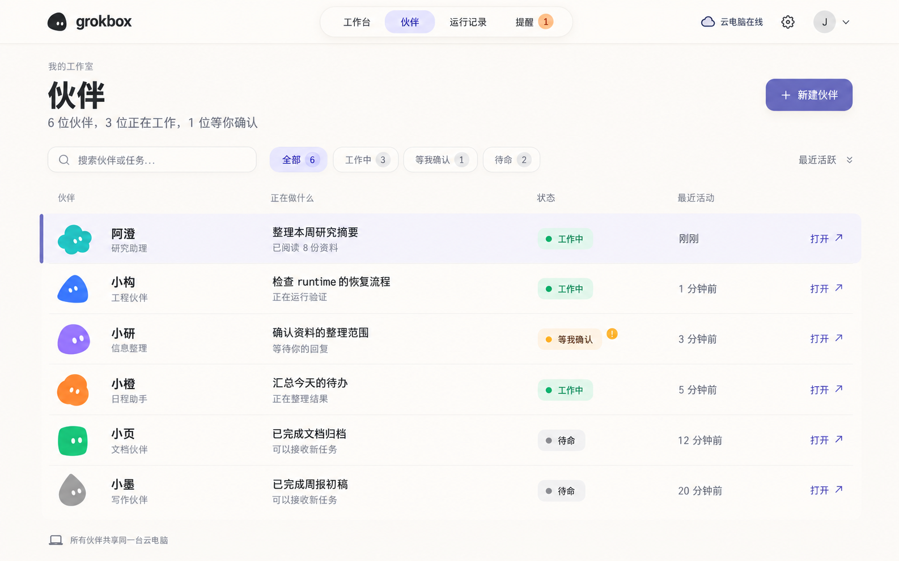
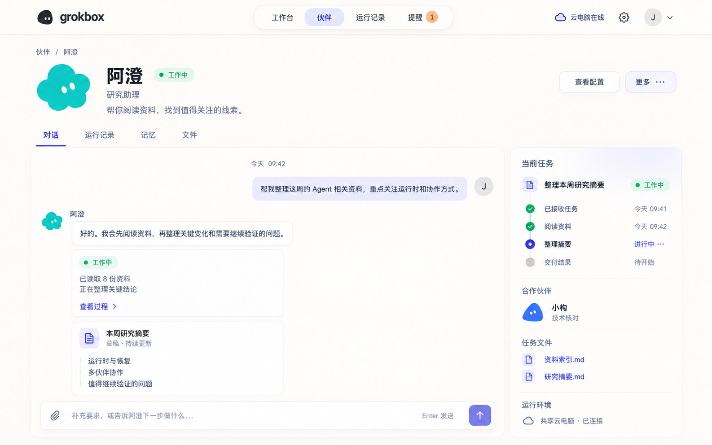
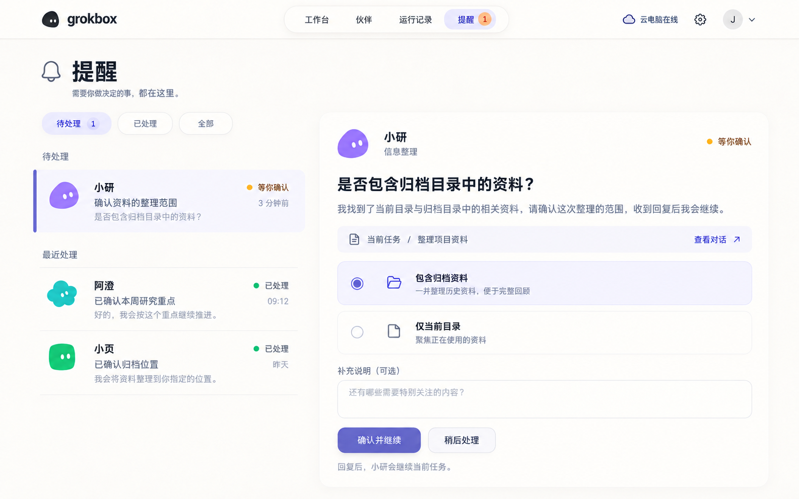

# Web UI V0 视觉基线

状态：V0 保存为视觉探索参考，最终风格尚未定稿，不是功能开发或工程验收前置。图中文字、按钮、状态与流程必须服从[页面功能目标](../../../roadmap/future/webui-console.md)和[来源可行性](../../../reports/2026-09-19-webui-source-feasibility.md)。

## 图稿与可用性

| 设计稿 | 保留的视觉关系 | 功能纠偏 |
| --- | --- | --- |
| [伙伴列表](partners.svg) | 行式列表、小官方形象、状态与活动优先、宽松行距 | “已阅读 N 份”需真实记录且不能代表理解；新建入口尚需功能资格 |
| [Bot 详情](bot-detail.svg) | 身份区、内容页签、主内容与辅助信息的层次 | 移除聊天 composer；固定任务阶段、交付文件归因和协作关系需真实证据 |
| 工作台（当前文件缺失） | 顶部胶囊导航、疏朗的内容分区、柔和卡片和小隐喻 | 移除发起任务、审批回复；小进度条不能冒充真实完成度 |
| [提醒](attention.svg) | 列表与详情、浅杏色注意信息、清楚的主次关系 | 图中确认继续、选项回复和补充说明不进入首版；改为 incident/alert 证据与有限管理 |

原记录包含四张 1586 × 992 的生成 PNG；当前工作树实际保存伙伴列表、Bot 详情和提醒三个 SVG 容器，内嵌 PNG 字节未作修改。工作台 `workbench.svg` 缺失，不以重画或占位图冒充原图。原始文件名、PNG 字节数、SHA-256 与资源缺口在 [manifest](manifest.json) 中；SVG 是保存容器而非可编辑矢量稿。固定报告保留其当时记录，不作为当前四张齐全的证明。

## V0 风格参考

整体是柔和、有呼吸感的 Bot 工作室。采用暖白画布、近白内容面、深灰文字、低饱和紫主色与少量杏色提示。顶部胶囊导航替代传统企业后台的常驻左侧菜单。内容之间留出清楚间隔，列表不挤成密集表格，也不让大头像抢走状态。

卡通与童话感来自官方伙伴轮廓、眼睛、折角等小细节。信息结构仍保持严格，颜色与装饰不承担唯一状态含义。详情或空状态可以放大形象，伙伴列表的形象保持小而稳定。

伙伴沿官方 shape/color 识别，不预制无限角色，不用随机插画替代真实 Bot。状态标记独立于身份色，不给官方形象添加机器人头、天线、手脚或职业服装。

| 用途 | V0 方向值 |
| --- | --- |
| 画布 | 暖白 `#F8F6F1` |
| 内容面 | `#FFFDF9` |
| 主要文字 | `#30332F` |
| 主色 | 柔和靛紫 `#6D72B5` |
| 选中/辅助背景 | 淡紫 `#EEECF7` |
| 注意信息 | 浅杏 `#F4DDC9` |

这些色值来自本轮设计方向，尚非实现 token 或对截图逐像素采样的结果。圆角、阴影、字体、响应式断点和动效时长后续以真实页面验证，不从生成图反推虚假的精确尺寸。

## 不从图片推导的功能

- 首版 Web UI 无聊天、发起任务、审批回复。官方客户端继续承担对话。
- 待命、工作中、等待用户必须有来源；unknown、stale、断连与空状态需要设计。
- activity 是可解释的有限类别；elapsed、工具条数和文件 mtime 都不代表任务百分比或交付成功。
- Bot 合作、run 关联、文件作者仅在有真实关系时显示。
- “云电脑在线”只说明其实际观测来源，不能同时代表模型可用、身份资格与 collector 健康。
- Memory、Project 文件、日志是重要页面，但这四张图没有完成它们的视觉细化。

## 下一轮视觉工作

以[WEB-01](../../../tickets/WEB-01-visual-baseline.md)为范围，先完成数据/功能核对，再补全 Memory、Project、日志及异常状态。官方头像兼容、身份/状态辨识、键盘焦点、对比度、减弱动效与窄屏布局需实际验证。本 V0 保留为固定基线，未来版本不覆盖它。

## 图稿预览

### 伙伴列表

### Bot 详情

### 工作台

工作台原图当前缺失；保留元数据用于找回，不展示伪造预览。

### 提醒

