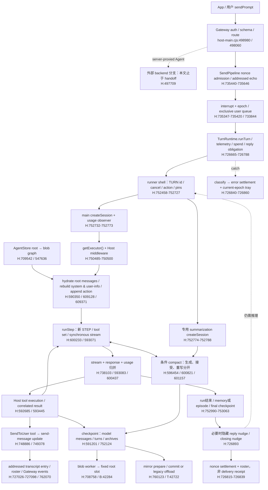

# Official Host：inbound → Agent loop 关键路径

> Publication note: operational identities below are synthetic examples. Private evidence locations and machine execution records are not distributed; historical observations do not qualify a current deployment.

**角色：固定源码版本的互操作架构地图，不是优化方案、补丁设计或实现完成声明。** 本文说明盒内 ordinary main 的消息如何进入官方 Host，哪些对象拥有上下文、推理、工具、投递和结算事实。先冻结事实与缺口；不据此提出产品修复。

[产品合同](../product-contract.md)、[运行时设计](../box-runtime.md)和 [D1–D12 裁决](../decisions/2026-09-08-host-seam-normalization-and-roadmap.md)仍拥有 grokbox 的接受行为。官方 Host 代码只是版本相关的互操作事实，不能把其偶然实现升级为 grokbox 产品义务。

2026-09-10 owner后续选择以B（前向预防+e2e）处理早期上下文损失，见 [修正与验收规格](managed-context-continuity.md)。历史A维持 **closed-notProven**，无新直接证据不再考古；这不修改下文的源码事实，也不表示修正已经实现。

## 1. 范围、来源与证据等级

### 1.1 覆盖边界

主线是 **App/用户经 Gateway 发给盒内普通单聊 Agent** 的 `sendPrompt`。group、server-proxied Agent、automation/background wake、widget answer、steer、upgrade resume 在适当位置标注分叉/汇合，不声称它们共用完全相同的 admission 或 UI。

不覆盖：完整 desktop App、backend/broker/image 发布实现；每一种工具/provider 的内部协议；新的模型/权限策略；现场推理、像素验证、历史 heap 还原或产品修复。没有 Host TERM、send、adopt、升级 RPC、credential 获取。私有 Host/worker 只作静态阅读，未加载执行。

### 1.2 源码 pin 与行号约定

核对日期：**2026-09-10**。下文 `H:行号`、`B:行号`、`T:行号` 是下列完整文件的 **1-based source line anchors**，不是 byte offset，也不是运行时 span：

| 代号 | 完整文件 | SHA256 |
|---|---|---|
| H | `/home/box/sand-host/host-main.cjs` | `f5cc35b57135ddbb5e32bbfa8e3bdcbdc9d6a88540043059feb8049280df2740` |
| B | `/home/box/sand-host/agent-isolation/agent-store-worker.cjs` | `5e65ff3dfa7fe0571809a62f9ee656901bac064f4b869afff55380b78232db9d` |
| T | `/home/box/sand-host/agent-isolation/transcript-mirror-worker.cjs` | `6d9aa1a15d06f5e53d96da98cc44a9eb009a1906d504450a634cabdaeb4e7987` |

H 约 28 MiB，包含多个 package/extension；文件大小超过 ast-grep outline 限制。此次以有界静态 TypeScript 5.9.3 AST 建符号/行范围索引，再定点阅读；三文件 parse diagnostics 为零，读前后身份/大小/mtime一致。B/T 也经 ast-grep outline。**解析成功不是执行成功。** 行号须与 SHA 一起使用；Host/worker、Proto schema、Gateway、pins、mirror routing 或 grokbox session codec 任一变化都会使相关结论需要复核。

grokbox 代码碰撞以 `pre-publication-revision…` 及其后仅文档改动的 `pre-publication-revision…` 为源码范围；既有取证所核验的已加载 preload 与较新源码不完全相同。本文不以 checkout HEAD 代替内存代码，也不重新声明当前 live PID/配置状态。

### 1.3 证据等级

| 等级 | 含义 | 不可推导 |
|---|---|---|
| **S / source-proven** | 在上列 pin 的函数体/调用边上存在该行为，注明实际前置条件 | 某 Bot 曾运行此分支、live flags 的取值、外部服务成功 |
| **D / disk-proven（复用）** | 下列既有只读事务/文件审计记录过具体落盘形状，并做过相应完整性核对 | 当前 heap、某历史 STEP 的完整输入、未记录的写入时刻/原因 |
| **P / offline probe（复用）** | 既有纯函数/合成 stream 检验支持局部语义 | 完整原生 Host 或 provider/工具/投递已经通过 |
| **N / notProven** | 缺少直接证据，或只有关联/条件源码 | 不能用“很可能”、最新 tag、表计数、成功标题补成事实 |

D/P 均明确是**既有研究的有界证据**，没有在本任务重新扫描产品库或重跑历史脚本。原 JSON、Bot 身份、root/message hashes、nonce、进程 census、日志和消息/Memory正文继续留在本机，不搬进公开仓库。

### 1.4 复用来源与纠正方向

下列本机路径是 provenance 引用，不是公共构建/阅读本地图的依赖。本文已把必要机制与纠正写出，不要求读者先读这些文件。

| 引用 | 来源 | 本文如何使用 |
|---|---|---|
| R1 | `PRIVATE_EVIDENCE`，及 `host-compact-full-chain-evidence.json`、`host-compact-artifact-links.json`、`host-compact-offline-probe.json`、`host-compact-final-check.json` 与对应脚本 | compact/root/pins/memory 的主研究；完整读取收据和脚本，完整解析/交叉校验脱敏 JSON；保留历史触发缺口 |
| R2 | `PRIVATE_EVIDENCE` | 保留初始 census；**不沿用 B/E 总体因果结论**，由 R1 的 blob-root/session 路由证据纠正 |
| R3 | `PRIVATE_EVIDENCE` | error tray/settlement 的主研究；UI仅来自既有 0.20.0 renderer参考，非当前 App 像素证明；本次修正清 tray 时机与一处行号 |
| R4 | `PRIVATE_EVIDENCE` | 当前两处 literal接缝、弱观察窗口与真实 retention入口缺口；建议部分不成为本文修复设计 |
| R5 | `PRIVATE_EVIDENCE`、`PRIVATE_EVIDENCE` | 原 HSO方案与 `pre-publication-revision` sensing增补的交付记录；**方案完成≠功能接通** |
| R6 | [外部 PromptSession reference](grok-bot-setup-session.md) | 借用同步 handle/消息/工具合同的阅读线索；它的旧“CURRENT MISS/ADOPT NOW”是历史 ticket语境，不当作当前代码结论或重启权限 |
| R7 | [D1–D12](../decisions/2026-09-08-host-seam-normalization-and-roadmap.md)、[box-runtime Host seam](../box-runtime.md#2-接缝)、[upstream integration](../upstream-integration.md) | 已接受边界：Host拥有 loop、root/compact、tools、store、Memory、SendToUser；本文不重新裁决 |
| R8 | [HSO 方案](../roadmap/host-seam-ops-recognition.md) | 更新感知/识别的唯一方案主页；本文只记录升级与正在运行的 loop 相交处 |

## 2. 端到端主线

这里不是“先一次性组好 prompt，再调用一次模型”。Host 一边管理用户意图、上下文和工具，一边多次 checkpoint；SendToUser 可以在整轮结束前发生，memory 后处理与最终 nonce settlement 又晚于模型结束。



图中的并行箭头不表示跨库事务；`N→END` 只表示不再继续当前模型/工具循环。工具和部分结果可在最终 response/usage 结算前产生；“模型完成”与“用户已收到结果”之间还有 Host 自己的分流。

### 2.1 沿一次普通 send 阅读

1. **Gateway 路由。** `H:498980–499064` 做浏览器请求检查、HTTP路径分流及配置了 token 时的 bearer认证，随后 `routeCommand`/`runGatewayCommand` 执行 schema解析（`H:495288–495313`）。`getTranscript/getAgentThread` 与 `sendPrompt` 是不同 API。server-proxied Agent在 `H:497709–497717` 可走远端；下面的盒内 runner不是全部路由的实现。
2. **接收不等于执行完成。** 本地 `sendPrompt` handler 在 `H:498060–498084` 把参数交给 manager。默认 `sendAcceptReturnDisabled=false` 时 `awaitTurn=false`，返回 `{accepted:true}` 不等待模型结束；`SendPipeline` 自身缺省 `awaitTurn=true`，两层默认不可混写。
3. **nonce与 addressed echo。** `H:735440–735482` 先按非空 nonce合并 in-flight Promise，再做 ledger digest查重。`H:735483–735729` 固定目标session、准备附件/回复引用、写用户echo、recordPending、发echo事件、排队后markAccepted。Ledger同nonce异digest会拒绝；**in-flight合并发生在重新计算digest前**，不能宣称所有并发重复请求都经过同一digest检查。
4. **UI副作用已先发生。** `H:735127–735151` 的 profile初始命名、清tray、清awaiting状态发生在后续附件/echo持久化前。`SandAgentDb.runWrite` 对部分locked-db写返回false；send会记录非durable并仍继续（`H:735614–735618`）。因此 visible echo / accepted不是严格的“已经durable且将完成”的证据。
5. **Host排队/抢占。** `dispatchUserTurn` 展开skills/提及对象/离线compose说明，产生新turnEpoch，打断旧runner，携带缺失用户消息恢复材料，登记ackToken后入user lane。旧排队消息只有在无附件/非fork、文本和前缀恢复证明等条件满足时才被跳过并结算cancelled（`H:726701–726734`）。不是简单drop-oldest。
6. **runner建立一次逻辑运行。** shell产生/沿用TURN UUID、取消上下文、run generation和ownership判断；先做容量/策略/privacy检查及action/pins准备，再创建main/summary sessions，随后等待box.ensureReady、MCP等并buildAgentForRun。核心main executor通常无参创建，之后才从blob root恢复，不是把UI JSONL塞进getExecutor形参。
7. **多STEP loop。** 每步生成STEP，构造本步tool set、stream options、usage与pending-tool checkpoint；Host消费流并执行工具，把匹配结果带回下一步。compact可以并发准备，在明确门槛下才接受并重写builder。
8. **多重收尾。** checkpoint/SendToUser可早于整轮完成；runner完成后可写Memory/episode、做最终checkpoint；外层仍可发hidden nudge补投递，再写nonce settlement、roster与tray。任一阶段的“成功”都不能替代另一阶段的证明。

## 3. 身份与多套账本

### 3.1 相近的 id / epoch 不是一回事

| 名称 | 拥有者/用途 | 锚点与边界 |
|---|---|---|
| `clientNonce` | 客户端一次send的接收去重与最终settlement关联 | `H:735440`、`H:726579`；本地普通send可缺省，缺失就不写nonce settlement |
| user/echo entry id | 产品展示条目的地址、reply/fork及恢复引用 | `H:735568–735611`；off-record/widget/background也可生成模型用户材料，不等于一次人工输入 |
| `turnEpoch` | SendPipeline RAM中的每session抢占顺序 | `H:735730–735741`；控制stale UI/运行判断，不是compactionEpoch或UUID |
| `inferenceRequestId` | runner shell的逻辑TURN，主运行/lineage/checkpoint语境 | `H:752475–752495`；grokbox第二切片将它放入main options；hidden nudge是另一次runner.run |
| STEP `invocationId` | 一次model step及InteractionHandler | `H:600237–600251`；`H:542425–542432` 默认generator为UUID，ctx可注入；不拿TURN补缺STEP |
| request-id update | 推理callback/telemetry/roster关联 | `H:752728–752731`、`H:727000–727014`；名字相同不证明与所有TURN/STEP/外部request id可互换 |
| `toolCallId` | stream descriptor、response assistant call、tool result、工具活动关联 | `H:593071–593580`；结果须能匹配response.messages里的assistant call |
| `ackToken` | 当前run对首个可见ack义务的所有权 | `H:727220–727256`；不是HTTP accepted，也不是结果投递已完成的证明 |
| `compactionEpoch` | 当前root lineage中`summaryArchives.length` | `H:596875–596904`；不是全生命周期compact累计数，也不是创建日期 |
| root slot / root bytes | AgentStore当前可恢复结构 | `H:707705–707710`、`H:547619–547628`；固定slot可覆写新bytes，id不变不代表state没变 |

### 3.2 账本目录：读什么才回答什么

| 账本 / 所在层 | 写入者与读者 | 保存的意义 | 不能代替什么 |
|---|---|---|---|
| `store.db / transcript_entries` | `SandAgentDb` append/update；Gateway transcript/thread/tail、roster/UI | addressed user echo、send-message、widgets/cards、spend-initiation/events等产品条目；带seq/id | 不是模型消息全量replay；只数`kind=message,role=assistant`会漏掉send-message |
| `store.db / kv` | `SandAgentDb`各领域getter/setter | metadata/root指针、pins、episodePending、lastTurnSettlement、awaiting状态等 | KV不是一个完整prompt，更不是所有字段都具有相同持久性/时钟 |
| `conversation-blobs.db / blobs` | Host `WorkerBlobStore` → B的worker_thread；AgentStore读取 | typed root、model-message JSON、turn/user/assistant/tool结构、summary archive、文件/subagent引用图 | blob总字节/数量不是窗口token数；不可把未被当前root引用的历史全加进模型输入 |
| current `ConversationStateStructure` | AgentStore/current RAM checkpoint；generic agent state handler | `rootPromptMessagesJson`、turn refs、tokenDetails、archives、pending tools、file/subagent等结构 | 一份结构不是已hydrate的字符串数组；root pointer相同不代表同一checkpoint |
| executor/builder `getState/getMessages` | PromptSession factory与Host append/clear/normalization | **本步实际持有的模型上下文**；stream以它和当前tools/options构造请求 | 当前磁盘root只能近似重建，不能倒推出历史每个STEP入口的精确payload |
| `agent-transcripts/<id>/<id>.jsonl` | routed transcript mirror/journal；legacy可由T读blob图重建 | 模型历史/工具的文件投影；能拼archives和current tail，格式转换/省略是该视图语义 | 不是`transcript_entries`的逐行导出，不是当前模型root，也不能直接把role=user计作人工输入次数 |
| mirror journal pending/cursor/mode | `FileTranscriptMirror`、`RoutedTranscriptMirror` | 文件投影准备/commit/recover的进度与所有权 | 不是AgentStore根，也不是与SQLite同时提交的事务日志 |
| prompt acceptance ledger | `PromptAcceptanceLedger`，Host root下send-acceptance文件及degraded marker | nonce/inputDigest的pending/accepted/rejected与history gaps | accepted不表示推理完成；损坏/驱逐/失写时有unknown-durability，不承诺永久exactly-once |
| ack obligations / upgrade resume | 各自Host store + RAM token/ownership | 未回复义务、暂停后需要继续的任务标记 | 不重建模型历史、不等于SendToUser最终delivery或grokbox adopt授权 |
| trays / outline / live events | RAM `TrayManager`、roster/outline，Gateway投影 | 输入dock错误、推理/工具活动等即时视图 | 不属于模型history；重启/清除/订阅间隙后不能当完整审计日志 |

**D事实纠正（R1对R2）：** 既有样本的模型root直接解析出了大量assistant/tool消息；展示表少量assistant message行并不表示模型只恢复了这些行。UI JSONL、展示条目、turn graph和当前root的计数明显不同。archive还保存历史，不意味着其summary carrier仍在当前模型root。具体统计与历史缺失段留在R1/R2证据，本文不搬运私有会话。

### 3.3 checkpoint与mirror不是一个原子提交

`H:591201–591246,591329–591368` 从builder序列化model messages及turn/archive等refs；`H:752124–752173` 的顺序是：

1. 按privacy决定mirror启用/跳过，必要时 `prepareCheckpoint`。
2. `AgentStore.handleCheckpoint`先写root blob，再设置metadata与RAM结构；slot由Host固定。B处理 `set-blob/get-blob` 等请求（`B:42284–42433`）；它不是`transcript_entries/kv`的写入者。
3. store失败则abort mirror准备；store成功后才commit mirror。journal commit失败可成为 `TranscriptAppendAfterCheckpointError`，**不能倒称root未提交**。
4. legacy mirror的写失败在路由层可被记录并吞掉（`H:760170–760193`）；不能把“任一mirror失败必定使turn失败”泛化。关闭privacy记录时另走skip逻辑。

Host composition实际接入 `FileTranscriptMirror.routed(OffloadingTranscriptMirror, sand_new_transcript_journal)`（`H:761158–761171`）；已由journal拥有的conversation维持其路由，未拥有的取决于gate（`H:760134–760147`）。T是legacy重建worker：只读blob库、hydrate结构、写JSONL，缺state报错（`T:42663–42761`）。hydrate archives时可跳过坏/缺blob或省略超大blob（`T:41947–42059`），这与model root restore遇缺blob抛错不同。

`SandAgentDb.runWrite` 对busy可返回false、对corruption有条件recover；metadata root写失败有专门异常，普通KV/entry writer各有返回语义（`H:706799–706919,707318–707402`）。已存在相同固定root id时metadata可不重写，blob bytes仍可已经更新。不能把一个CAS/flush/同id当跨blob库、store库、文件mirror的事务证明。

## 4. Critical point catalog

本表是**主链导航目录**：S表示源码行为，条件与不确定性见正文。碰撞栏的C编号仅指§8事实，不附修复方案；“—”表示此次未建立具体managed差异，而非已证明完全兼容。

| id / 点位 | 输入 → 输出 | 副作用 / 事实写入者 | 失败模式或证据边界 | managed碰撞 |
|---|---|---|---|---|
| CP01 Gateway/auth/schema — `H:498698–498707,498980–499064,495288–495313` | HTTP、target、nonce → typed method | command timing/error telemetry；不直接组模型上下文 | auth/schema拒绝；server-proxy分支另路 | — |
| CP02 acceptance — `H:735440–735482,723035–723108` | nonce/input digest → dispatch/duplicate/reject | acceptance文件、RAM inFlight；degraded/gap记录 | inFlight先合并；durability未知不等于not-found证明 | — |
| CP03 addressed echo/attachments — `H:735483–735646` | 用户文本/附件/reply → echo/userMessageId/材料 | store entries、内存transcript、附件、profile/awaiting/tray/roster | 附件/存储失败；可non-durable accepted；chat switch不改addressed store | — |
| CP04 queue/preemption — `H:735305–735422,733844–734140` | user task/epoch/ack → runnable | priority queues、cancel旧run、scheduler telemetry | stale recovery需证明；watchdog可escape并保留zombie，不等于物理旧工作已消失 | C7 |
| CP05 TurnRuntime shell — `H:726665–726788` | session/runner/epoch → runner.run | active maps、spend-initiation、trace、用户entry关联 | run readiness、superseded、privacy及store边界 | C7 |
| CP06 logical TURN/guard — `H:752458–752696` | options/action origin → TURN/cancel/generation | run lifecycle、permissions direction epoch、容量/策略/privacy检查 | 空请求、取消、size guard、策略/privacy失败 | C1 |
| CP07 pins/action glue — `H:752697–752727,742393–742556` | profile/memory/sections/turn文本 → frozen prefix与suffix更新 | KV pins/announcedRender、RAM承诺 | snapshot缺失/epoch漂移；材料变化≠compact | C4 |
| CP08 main session — `H:688363–688405,752732–752773` | main options → PromptSession/sanitizer | 官方model/client选择、usage/model观察 | 官方前置构造失败；selected managed入口早于它 | C1 |
| CP09 dedicated summary session — `H:752774–752788` | summary options →独立session | official summary transport（调用时） | no agentId不等于managed；summary错误另由orchestrator处理 | C1 |
| CP10 box/tools/executor composition — `H:752814–752905,687857–687869,750485–750500` | session + box/MCP准备 + state? → builder/executor/middleware | box确保就绪、tool discovery、RAM builder/latestPrompt getter | box/backend不可用、discovery取消；fresh executor vs复用 | C2 |
| CP11 root restore — `H:590350–590449,709542–709561` | rootPrompt refs → hydrated模型消息 | blob读取、builder clear/append、restore telemetry | missing/坏blob；metadata recovery与正常restore不同 | C4 |
| CP12 system/user-info/new turn — `H:609128–609410` | prior/messages/action/context →新system+selected prior+当前user | builder重建、user/turn refs、可初始checkpoint | 条件rerender、import/recovery/中断tool补充；不是全量UI replay | C4 |
| CP13 STEP/tools/options — `H:600233–600374,593071–593084` | builder/current tools →同步stream handle | STEP、tool contracts、可pending-tool checkpoint | tool/schema/config变化；TURN与STEP不能替代 | C1,C3 |
| CP14 response/usage normalization — `H:738103–738245,600437–600503` | stream+promises →response/messages/U/W | resolved model、self-summary/early-h cache、tokenDetails | rejection/malformed response；部分消息可在error前checkpoint | C5,C6 |
| CP15 streamed tool collection — `H:593083–593435` | deltas/calls →descriptor、response消息 | RAM buffers/iterables、tool diagnostics | 重复id、坏args、response/流不一致；不是先等全轮再执行 | C4,C6 |
| CP16 tool execution/results — `H:592685–593020,593445–593584` | descriptor/ctx/权限/toolMap →result消息 | Host tool实际副作用、approval、tool refs/telemetry | tool-not-found、args/refusal、cancel、exec-backend unavailable；不保证无外部effect | C6,C7 |
| CP17 compact lifecycle — `H:596454–597039,600821–601293` | U/W/images/pending/error →候选/接受/重写 | RAM generation、archive blobs、builder replacement、epoch | started≠accepted≠durable；前缀变/abort/fallback/错误各分支 | C1,C2,C4,C5 |
| CP18 checkpoint — `H:591201–591368,752124–752179` | current builder/turns/archives →root+mirror进度 | B blobs、AgentStoremetadata、文件journal | root已提交而mirror失败；旧run ownership fence；无跨库原子性 | C2,C4,C7 |
| CP19 SendToUser — `H:748886–748982,749378–749410` | tool args →send-message update/result id | attachment ingest、tool result、complete/pause信号 | 正在awaiting-user、block reason、suppressed card；成功shape非像素proof | C6 |
| CP20 product delivery — `H:727026–727098,735749–735752` | send update →addressed entry/events | transcript_entries、thread/batch、ack obligation、roster/channel | offscreen路径/第三方channel分支；持久/传输/用户读到非同一件事 | C6 |
| CP21 live presentation — `H:751305–751335,762070–762104` | text/thinking/tool/send/tray →observer/events | outline、composing、transcript/tray/agents channels | 普通text delta不是SendToUser；断连/错agent/清除视图 | C6 |
| CP22 stream attempt/retry — `H:751450–751659,725233–725322` | error/output/checkpoint →retry/resume/throw | attempt token、deadline、retry telemetry | 需eligible且有预算；checkpoint failure优先；取消不回滚已发生工具 | C6,C7 |
| CP23 completed-turn memory — `H:752254–752287,751873–751931` | exchange/main session →facts/evidence/episode | Memory文件或evidence接口、episodePending KV、labeling | hidden/superseded gates；memory生成失败可被吞并记录 | C2,C3,C6 |
| CP24 final checkpoint — `H:752990–753069` | finalState/owner →持久状态与result | final mirror/root、automation completion、reminder claims | generation/owner不符不提交；最终checkpoint仍可能失败 | C2,C7 |
| CP25 reply completion — `H:726793–726819,726893–726936` | sentMessageCount/reacted/epoch →hidden nudges | 新runner调用、delivery telemetry、可能新增推理/工具 | 最多3次reply nudge及独立closing nudge；delivery owed仍可能settle success | C3,C6 |
| CP26 nonce settlement — `H:726579–726602,726819–726860` | clientNonce + outcome/error →KV | lastTurnSettlement、roster、turn telemetry | nonce为空不写；write可失败；不是SendToUser回执 | C6 |
| CP27 error tray — `H:726840–726860,756216–756343` | current-epoch classified failure →tray | RAM tray、tray events；清理由独立操作 | stale epoch不push；dismiss/clear/next send前置阶段可移除 | C6 |
| CP28 ack/redrive — `H:727174–727402` | 未fulfilled义务 + idle/boot →后续run或lost | obligation store、RAM token/timer、telemetry | valid ackToken/gates/owner；首次ack≠后续工作结果已交付 | C7 |
| CP29 upgrade pause/resume — `H:684194–684218,736089–736248,752949–752979` | 官方prepare/暂停意图 →安全checkpoint后quiesce/resume marker | automation wakes、upgrade-resume store、cancel/run状态 | pending tools时不暂停；ownership/timeout/后续换代未知 | C7；详R8 |
| CP30 capacity/GC — `H:707743–707909,B:42117–42250` | 文件容量/可达root →GC或拒绝TURN | blob删除/维护与stale-root marker，均官方职责 | hard size拒绝≠token overflow，GC不生成LLM摘要 | — |

## 5. Context、compact、Memory与pins机制

### 5.1 原始session、Host包装层与模型材料

官方 `ProtoPromptSession.getExecutor(state)` 每次 `new ProtoPromptBuilder(state)`（`H:687857–687869`）。Host的 `sanitizePromptSessionUsage` 再提供 `getExecutor`、`getExecutorWithoutResolvedModelTracking`、resolved model和earlyCompaction观察（`H:738199–738245`）；后一个包装访问器实际调用原session的getExecutor。**不要把包装层的方法误写成所有原始session都原生实现。**

main组合先拿无参executor，装上路径归一化、SendToUser/ack提醒、loop nudge、first-stream snapshot、automation-completion和tool telemetry中间件（`H:750469–750500`）。generic agent再加载root messages，构造request context/工具、保留非system prior，重建system及条件user-info，附加action后进入turn。

`H:609186–609239` 的user-info重建原因包括model/tool相关fingerprint、context recovery、compaction epoch、部分工作模式/规则/历史导入；新system不表示丢弃全部旧history。`recentUserMessages`、reply引用、unanswered widgets、steer和恢复消息是**有特定用途的补充材料**，所以也不能反过来声称“展示条目绝不会影响context”；它们不是把UI全历史当模型根。

### 5.2 五种推理用途

| 用途 | session / executor | STEP、工具和预算 |
|---|---|---|
| ordinary main STEP | main session →无参fresh builder →root hydrate/Host装配 | `stream(ctx, STEP, tools, options)`；主模型/工具循环 |
| external conversation summarization | 独立 `isSummarizationSession=true`，当前常量为`gemini-2.5-flash`（`H:334934`）；`getExecutor([system,user])` | `H:518376–518453`：无STEP、无tools，maxOutputTokens=32000；当前main-only agent-id patch不把它纳入managed |
| generic/self summarization | main session的untracked访问器，经 `SandSelfSummaryPromptToolExecutor` | `H:545371–545546,750751–750758`：创建STEP并使用summary工具schema；Host composition未指定别的flavor，不能仅因bundle有其它handler便说它们都执行 |
| memory extraction | 完成后复用main **session**，但官方每次取得新executor；append extraction system/user | `H:697672–697705,751911–751931`：无STEP，无tools，收集文本、解析add/remove |
| episode summarization | 同main session新executor；append多turn的摘要输入 | `H:697732–697744,751886–751904`：同样无STEP，默认达到6个eligible exchange；不是conversation compact |

无STEP是一种真实官方辅助调用形状，不是所有session的输入错误。managed是否相撞还取决于它是否选中了同一session；“createSession入口被经过”不等于“已managed”。

### 5.3 token启动阈值不是用户消息计数

令 `U=tokenDetails.usedTokens`、`W=maxTokens`。普通STEP在响应归并后取 `usage.totalTokens` 与 `extendedUsage.maxTokens` 更新（`H:600471–600503`）。W是上下文容量，不是summary输出上限或maxSteps。

默认门槛（`H:508516–508544,750152–750172`；显式override可替换）：

```text
valid early-h：safe integer，0 < h < W，且W finite
startThreshold(W) = undefined                            if W <= 0
                  = min(W - 10000, 0.90 * W, 有效h若提供)
S(U,W) = threshold存在 && U >= threshold
P(U,W) = S(U,W) && (W-U <= 5000 || (W-U)/W <= 0.05 || U达到有效h)
```

早期h只在非subagent、self-summary可用、响应报告threshold且inputTokens达到它时提供；每次请求清旧hint，错误响应不贡献threshold（`H:738200–738241`）。普通启动还要求非cloud单步、tokenDetails不stale、未被输入上限失败抑制。orchestrator还可由eval override或self-summary自身predicate启动（`H:596461–596477`）。

self-summary优先使用正的有限U，否则估算模型消息（含非文本/overhead），与eval/config limit或`floor(0.9*W)`比较（`H:519585–519606,521039–521054`）。这不是“每N条人工消息”。历史P验证了W=0时普通S/P均false；不能把未知容量0解释成模型窗口真的只有0或已到阈值。

### 5.4 触发、接受、持久化分开

| 路径 | 条件/动作 | 源码 |
|---|---|---|
| STEP开始后台启动 | 默认S、eval/self-summary；非maxSteps=1、非stale、非失败抑制 | `H:600375–600415` |
| response期间early启动 | 本次input达到仍有效h、STEP未关闭/取消、无现存generation且self-summary可用 | `H:600424–600433` |
| mid-loop已有完成候选 | 未被抑制，图片≥85或关闭mid-loop门槛或S成立；**不要求P** | `H:600846–600880` |
| mid-loop候选未完 | W>0且U超过W+min(0.25W,50000)才强制等 | `H:600886–600905` |
| 图片阈值 | 模型消息递归image/image_url/input_image计数≥85；含experimental content | `H:599608–599636,600907–600923` |
| TURN尾 | pending且P或图片阈值；完成才接受，显著overage/图片才阻塞等未完成候选；否则延后/丢弃 | `H:601157–601293` |
| 输入容量/图片错误 | 识别到具体InputTokenLimit/too-many-images/documents，阻塞external摘要，再重试原工作 | `H:600941–600979`；不是任意auth/HTTP/timeout错误 |
| 显式summarize action | 有messages、fullSummarization、WaitForCompletion、force_option | `H:604528–604626`；未证明普通App某按钮/文本命令触发它 |
| debug/eval按条数 | production非eval时排除；其余可由debug策略文件选next/every-human/tool等 | `H:518967–519010`；R1只记录当时文件不存在，不证明过去未用过 |
| 跨TURN pending adoption | v2 record、同conversation、当前前缀hash/计数匹配、仍值得compact；RAM generation另有claim路径 | `H:601791–601873,741059–741111`；此Host pending store是RAM，不是重启持久KV；record无TTL gate |

Host主loop `maxSteps=5000` 是循环预算（`H:750151,750760`），不是compact条数门槛。generic错误重试、stream transient retry、summary retry、reply nudges是不同层，不能把其中一个次数当整个用户send的统一重试上限。切模型可改变W/资格/错误，不是独立“切换即compact”规则；re-adopt、system重渲染、pin刷新、磁盘GC也不是compact。

接受摘要时（`H:596841–596904`）：验证generation prefix及错误/abort策略 → 为被摘要材料、carrier/summary/windowTail写archive → push archive（epoch增加）→ clear/append replacement + 生成期间追加的尾段 → 标记token stale/compaction boundary → 后续checkpoint才可重启恢复。`windowTail`元数据不是唯一重写依据，实际使用replacementMessages；旧archive可保留而不在当前模型窗口。

external分区保留system、可识别user-info、carrier与末user尾段等，preserve-last-user可导致相邻archive材料重叠（`H:519131–519167,519257–519293`）。摘要输入还受工具part约100000字符、Host摘要prompt 2800000字符、9 MiB字节guard及最多3次生成重试影响；可缩减序列化输入（`H:518359–518858,738260–738268`）。这些是**summary输入**规则，不是normal TURN的隐式截断器，也不保证archive每个字节都被摘要模型看过。

### 5.5 pin刷新、记忆生成与上下文压缩是四件事

| 机制 | 何时改变 / 如何传给模型 | 副作用与锚点 |
|---|---|---|
| legacy memory pin | 同compactionEpoch复用，否则live render；有facts才保存；可被disable/forget失效 | `memoryPromptSnapshot`；`H:697352–697368,742489–742510` |
| stable sections | memory/automations/agent_directory/mcp_instructions同epoch复用，缺失或epoch变则重渲染（含空） | `promptSectionSnapshots`；`H:705600–705609,742516–742526` |
| 同epoch公告 | 部分section的live render不同于announcedRender或frozen render时追加当前TURN差异说明；不替换frozen内容、不增加epoch | `H:705611–705622,742539–742556,752715–752727` |
| profile pin | 同epoch冻结身份；identity改动另行公告，下一epoch合并 | `agentProfilePromptSnapshot`；`H:738651–738662,742393–742429` |
| prefix observation | 主请求system/tools/user-info/section hashes与epoch、source、时间；辅助无工具请求不覆盖最近main | `promptPrefixSnapshot`；`H:751085–751301`；不是prompt缓存或compact执行时间 |
| memory extraction | eligible completed exchange后，解析新增/删除facts，交Memory store应用 | `H:697685–697705,751911–751931`；失败记录后继续，并不必然让TURN报错 |
| memory evidence接口 | 如store有recordMemoryEvidence，写该接口并清episodePending，不走同一即时LLM提取分支 | `H:751873–751882`；具体store能力决定路径 |
| episode | 无evidence接口时记pending exchanges，到interval后summary并写log；finally清pending | `H:751886–751907,707403–707414`；生成失败与finally清理不是成功摘要 |
| 显式memory操作 | Host memory/state tools可写/forget，忘记可清legacy pin与memory section pin | `H:748173–748183,707421–707430`；不是compact |

`settleCompletedTurn` 对hidden、superseded、空输入等有gate；短句不在trivial集合也可eligible（`H:697402–697409,752273–752285`）。前次“summary被拒绝，所以Memory/compact快照都无法刷新”不成立：**提取事实、episode、render/pin、conversation compact**有独立触发和writer。

R1的D证据发现stable sections经Host路径别名归一化后确实进入当前system，legacy pin虽存在却不是那次选中的材料。pins多数没有创建时间；prefix recordedAt是请求观察时间，archive覆盖到的最后用户材料时间也不是compact时间。没有这些历史字段，就不能声称“某pin冻结了多少天”。

## 6. Stream、工具、用户投递与失败收尾

### 6.1 同步handle与异步归并

`stream(ctx, STEP, tools, options)`同步返回handle。Host同时需要fullStream和独立response/usage/extendedUsage/providerMetadata/invocationId；`sanitizeStreamResult`要trim `response.modelId`，更新resolved-model/self-summary support/early-h及usage（`H:738103–738245`）。只给最终字符串、只给stream或省略messages都会改变实际消费者语义。

`streamModelAndCollectToolCalls`把fullStream复制给内部collector与外部InteractionHandler；累积text/reasoning/call deltas，处理重复call id，组合response.messages，必要时用已收集内容合成消息（`H:593071–593435`）。`executeToolStream`并行追踪工具Promise，最后仅保留能匹配assistant tool-call id的结果（`H:593445–593584`）。因此工具result是否回到下一步取决于correlation和response形状，不是只看模型“有输出”。

工具由Host登记的toolMap、schema/安全args、permission/approval、resource accessor执行；provider不拥有执行权。工具可以消费args stream；未知工具可返回tool-not-found结果，exec backend失效可停止后续工具执行并产生错误result。工具本身可能有不可回滚副作用，checkpoint/取消/模型retry不等于外部action撤回。

### 6.2 Plain assistant text、SendToUser与reply obligations

普通text/thinking delta进入outline/活动观察与模型状态；`handleAgentUpdate`对这类update不追加send-message（`H:726946–727165`）。ordinary chat的用户投递工具是`SendToUser`，保留旧`SendMessage` execution alias；不是所有assistant文本都自动变成普通聊天泡泡。Gateway/App 上同一条路径如何分成 sidebar Working、composer-above Working、tray 见 [Host/App projections](host-app-projections.md)；本文仍只 pin Host inbound。

`H:748886–748982` 的tool按类型解析文本/附件/widget/card等，检查awaiting-user和transport block；`H:749378–749410` 发 `send-message` update，`H:727026–727098` 做reply合法性、thread/batch、addressed store追加、ack与roster更新。附件可先经过ingest。widget/secret-request会进入等待用户路径；可选end_turn在checkpoint后的stop判断中结束运行。这里只描述Host已有能力，不授权本任务请求用户输入或发送内容。

区分三个“ack”：

- **send acceptance/echo**：Host已接收/排队这个用户请求。
- **ack obligation fulfillment**：匹配有效ackToken的SendToUser清掉未回应义务（`H:727237–727256`）。这是首个可见回应，不证明工具工作后的最终结果已经交付。
- **delivery result**：外层看`sentMessageCount/reacted`等。无投递时最多3次hidden reply nudge，silent tool尾部还可有一次closing nudge（`H:726893–726936`）；不是再发一次Human消息，也不等于grokbox偷偷重试模型。

即使nudge后仍欠delivery，当前外层会报告empty-delivery，再按runner的aborted/paused状态结算success或cancelled（`H:726808–726839`）。所以 **nonce success不单独证明用户收到有效答案**；SendToUser local entry也不单独证明远端App已显示/用户已读。

### 6.3 Retry、checkpoint与取消

`createStreamAttempt`在每次attempt固定identity；first-token/idle deadline、tool-in-flight和checkpoint Promise分别处理。deadline触发会取消attempt，并等待已开始checkpoint的结算；checkpoint失败优先传播。是否retry由错误类型、cancel状态、是否已有output及可用checkpoint等决定；已产出内容时允许的恢复从已记录checkpoint继续（`H:751450–751659`）。

Host generic loop另有output-limit reminder、empty-response和single-message-loop retry（`H:600701–600814`），以及§5的input-limit compact；不能把auth错误、客户端不显示内容、token阈值、模型response空白都归成一个重试原因。

scheduler的“exclusive”是队列所有权语义：正常每Agent一个active；等待user过久可interrupt，宽限后escape，将旧settled Promise留在zombies并启动后续任务（`H:734038–734140`）。runner/epoch/generation/checkpoint fencing仍各自存在。没有真实quiescence证据就不声称旧provider/tool已经停下；本文也不把该源码分支直接定性为某个历史重复副作用的原因。

### 6.4 Error tray与nonce settlement：同一catch的两个产物

来源R3，重新核对 `H:726454–726494,726579–726602,726840–726860`：

```text
runner / retry最终抛错
  → classifyAgentError（checkpoint、backend、capacity、stall、overflow、retryable…）
  → turn.finalize(error, catalog tags, detail) / telemetry
  → 非空clientNonce才写 lastTurnSettlement(errorCode/domain/retryable)
  → 仅current turnEpoch：describeAgentRunError + hostTrayTitle → TrayManager.pushError
  → roster update；finally释放active maps、ack token与session run计数
```

| 结果面 | 有哪些字段/语义 | 不等于什么 |
|---|---|---|
| `lastTurnSettlement` KV/roster | clientNonce、outcome、settledAt、错误code/domain/retryable，可选botBlock | 不保存connectCode全部内容；不是tray对象；缺nonce不写，写失败可记录后继续 |
| error tray | agentId/id/title/errorKind/detail/actions/requestId等，RAM push/clear/dismiss | 不由errorRetryable真假直接决定是否出现；不是模型消息或settlement记录 |
| Gateway tray事件 | `H:762104` channel=tray；也有getTrays及dismiss/clear API | 事件/缓存缺失不能反推没抛错 |
| 参考App输入dock | R3的0.20.0 renderer把当前Agent trays放在composer上方 | **N：当前App版本/实际像素未核验**；send-error notice、transcript-load error、retry shimmer是其他视图 |

`SAND-E0406` 是agent域retryable的兜底分类之一，不说明底层就是某一种provider认证/网络原因；capacity、stall、overflow、hard terminal等有更早分支。`sandErrorTags`正确anchor是 **`H:480056–480077`**，R3的超大“行号”不是可用line anchor。

两处必要限定：

1. R3的“下一次durable user send清tray”过强：清除在 `applySendRosterSideEffects`，发生在echo写入前；后续send失败或非durable也可能已清（`H:735127–735151,735531–735541`）。
2. catch本身不append错误文本到模型/产品transcript；但较早stream可留下partial assistant/tool消息，`runStep`在error/abort时还可checkpoint response.messages（`H:600493–600503`）。因此“tray本身不是context”成立，**“只要最后走tray，context就绝不含失败前的文本”不成立**。

## 7. Host升级只在这些点影响loop

完整更新机制、boot-fetch、swap顺序、rollback/veto和多信号感知统一见 [HSO](../roadmap/host-seam-ops-recognition.md)，这里不再复制更新状态机。

- 官方 `/prepare-upgrade` 进入 `HostUpgradeService.prepareForUpgradeOnce`，请求transcript暂停并暂停automation wakes；若暂停失效则恢复background work（`H:684194–684269`）。
- `UpgradeRecreateResume` 区分upgrade/recreate暂停owner、running turn计数、pause超预算及resume ownership；发给runner的是pause意图而非在任意tool中途当作成功退出（`H:736089–736248`）。
- runner在checkpoint后且无pending tool calls才把`pausedForUpgrade=true`并取消本run；外层记录resume marker、nonce cancelled（`H:752949–752979,726793–726828`）。
- `host-upgrade-resume.json` 等Host产品标记与 `.sand-host-upgrade.json` swap结果是不同对象。resume拥有明确owner/identity检查，重新进入Host runner；恢复提示中“full conversation intact”只是提示词，实际材料仍取决于root/blob与checkpoint，不能拿这句文字当恢复完整性证明。
- Host重启会丢RAM pending summaries、session/executor、trays及部分watcher状态，持久root/pins/archives可重新读取；官方新代次不自动带上managed preload。磁盘新SHA、Gateway新PID和loaded compile事实必须分开。
- grokbox HSO完成的是方案，不证明已接入这些点。literal/SHA fail-closed和独立adopt权限不变；此架构地图不触发更新、恢复、代码重建或canary。

## 8. 事实附录：open seams / managed grokbox碰撞

这里只列已经建立的差异及证据上限，不提供补丁/优化方向。

| 编号 | 已知事实 | 证据 / 不推导 |
|---|---|---|
| C1 main-only identity与辅助session | 当前agent-id/TURN切片只改mainSessionOptions；dedicated external summary缺agentId则selection official；main派生用途不重新做同样选择 | [live-slices](../../packages/box-runtime/src/internal/host/live-slices.ts)、[session-hook](../../packages/box-runtime/src/internal/host/session-hook.ts)、R1/P；**R2“拦截所有summary导致managed拒绝”被纠正** |
| C2 executor生命周期 | 当前`asHostPromptSession`的两个accessor返回同一executor，共享session级messages；无参不clear。官方Proto factory每次新builder | [session.ts](../../packages/box-runtime/src/internal/host/session.ts) `163–232`、`H:687857–687869`、R1/P；有辅助追加/共享风险，但未证明它独自造成历史summary正文缺失 |
| C3 auxiliary没有STEP | memory extraction/episode从main session取executor且无STEP；managed requireStepId在构建envelope前拒绝。generic self-summary有STEP；专用external session未managed | `H:697672–697744,545371–545546`、session.ts `181–220`；R1的完成后reject时序支持用途交叉归因，**逐条缺直接purpose/span** |
| C4 Host metadata投影 | 当前codec投影为role/content，非payload正文截断，但会丢Host message id/providerOptions语义字段 | [context codec](../../packages/box-runtime/src/internal/host/context-codec.ts)、[kernel context](../../packages/runtime-kernel/src/internal/contract/context.ts) `94–138`；R1/D/P，影响summary/user-info/prefix判别；历史写入者仍N |
| C5 usage/capability不等价 | current toHostStreamResult固定cache tokens及maxTokens=0；不转发全部Host响应能力字段 | session.ts `83–126`、`H:738103–738241`；R1/D/P支持普通S/P无法据W=0启动，不证明所有compact分支被禁 |
| C6 failure信号与投递 | 较早已加载dist可把拒绝生成为error text-delta；R1有memory log的聚合匹配。较新source已改为抛出/拒绝路径 | session.ts `99–156`、R1/R3；不把较新checkout解释成旧进程行为；Host catch与SendToUser/Memory是不同消费方 |
| C7 owner/lifetime不是同一层 | Host有queue/turnEpoch/runGeneration、工具、nudge、memory、upgrade-resume；grokbox有TURN/STEP/binding/ServiceEpoch | 源码主链与R7；接缝marker/modeld health不证明Host整个产品loop；没有逐场景live生命周期资格声明 |

R2的其余结论也要限缩：未发现**当前**CAP或codec按窗口删正文，不证明历史从未改写；展示表不是模型输入；出站eventCount不是inbound messageCount；同一个pin的字符数与UTF-8 bytes不能直接比较为“增长”。R1保留的archive/carrier与当前root之间确有历史缺口，但缺少旧root/写入事件，不能归责于re-adopt、Host compact或当前codec。

R4/R5只支持literal接缝及未来ops方案；旧contract windows不是LIVE两片重放，scheme receipt写“闭合gap”指设计上的闭合，非代码接通。R6的外部实现后置hook、in-place rewrite、fallback或buffered streaming不移植为本项目事实。

## 9. Open questions / instrumentation gaps（无修复设计）

| 未证明的问题 | 现有证据为何不够 |
|---|---|
| 某次历史compact何时start/finish/accept/persist、当时U/W/原因、external/self/fallback哪条 | archive schema不存这些时间/触发字段；覆盖材料时间只是下界，epoch只是lineage |
| 更早summary/carrier及尾段何时由谁从当前模型root移除 | 固定root slot可覆写；R1没有可用pre-turn-root链，有限WAL未补齐旧快照 |
| 每个历史STEP真正bind/envelope/request的消息计数与metadata形状 | 当前root + 最后tail只能重建候选，既有journal无入口shape/purpose；不是heap/网络捕获 |
| 每条missing-step拒绝究竟是extraction还是episode等用途 | 顺序/时间与源调用图相符但缺直接call-purpose/span；不把相邻时间当唯一归因 |
| 当前live flags、pending summary、mirror routing、early-h/self-summary cache | 源码有分支，D文件不等于RAM；没有新heap读取或现场RPC证明 |
| scheduler escape后旧工具/provider的物理停止与跨层late callbacks | 有zombie bookkeeping和owner fences；本任务没执行竞争/quiescence探针 |
| accepted / SendToUser local append之后的跨库durability、远端显示、用户已读 | 单个API返回、entry、checkpoint、settlement只各证一层；无共同原子事务或App像素证明 |
| 当前App是否另有settlement消费者/不同error视图 | R3 renderer是固定旧参考，不是当前App；Host只证明tray与roster输出 |
| 新Host/image/recreate后上下文与managed激活是否完整恢复 | Host pause/resume源码与HSO方案不等于实际升级回归；外部broker/remount行为仍N |

维护本图时更新pin、对应行号和受影响语义；保留被纠正研究的来源及证据等级。不用新推测抹去旧事实，也不把缺证问题顺手变成未经批准的修复任务。
