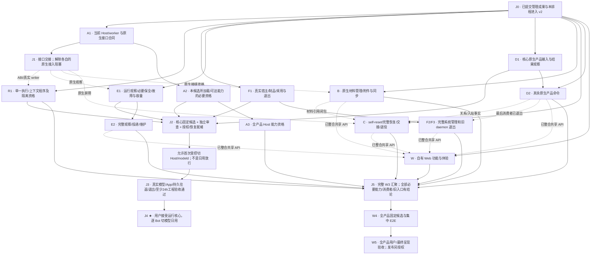

# 并行交付拓扑：运行核心先日用，完整产品继续收束

2026-09-22 接受的排程校准。最终产品范围、唯一现行实现、原生数据安全和已接受质量不降低；**W3 内先交付可完整验收的运行核心，用户确认后开始逐 Bot 切模型日用；自有 Web 和其余管理能力并行完成，随后进入全产品 W4/W5。** 不是恢复旧版本、另做轻量 Harness 或长期双 writer。

本页只拥有路线责任、依赖边和汇聚顺序；[Spec](spec.md)拥有产品边界，[重建骨架](implementation-impact.md)拥有 W1–W5 和模块方向，来源票拥有实现差额，[LIVE](../../tickets/LIVE-integration-validation.md#core-runtime-lane)拥有采用判据和实际结果。路线里列出交付条件，不维护另一份 passed 清单。

## 先找到自己的路线

每张路线卡可单独交给实施 Agent：从指定 v2 基线核对现行源码，只承担该卡的事实 owner、模块和出口。所有路径相对仓库根。路线代号是调度标识，不替代原来源票，也不要求每条路线各占一个常驻 Agent。

| 路线 / 建议分支 | 独占责任 | 核心采用前必须交付 | 后续交付 |
| --- | --- | --- | --- |
| [A · Host 资格](routes/a-host-qualification.md) / `feat/w3-host-current` | 原生来源、唯一配方、Host 接缝注册、worker ABI、Rust/Oxc 和运行健康见证 | A1 当前来源/ABI合同；A2 本候选所加载/可达能力的必要资格 | A3 其余能力与新增原生接缝的全覆盖 |
| [R · 模型执行](routes/r-managed-runtime.md) / `feat/w3-runtime-dogfood` | STEP/TURN、模型/effort、流/工具、辅助推理、compact、原生持久会话 | R1 当前集成运行程序；R2 真实模型/原版 App/官方往返证据 | 后续扩展的执行回归，不重建另一 loop |
| [F · 系统与宿主](routes/f-system-lifecycle.md) / `feat/w3-system-cutover` | 安装、服务生命周期、controller、故障恢复、配置/访问及最终系统入口 | F1 固定制品、目标宿主、独立寿命、安全采用/退出 | F2 完整系统管理；F3 旧 daemon 与系统合同最后退出 |
| [E · 观察与必要保护](routes/e-observation-and-safety.md) / `feat/w3-observation-delivery` | 原 OBS/incident/outbox、运行期诊断、必要默认保全装配及资源维护 | E1 核心故障/失权/保全/容量与已启用自动动作的闭环 | E2 完整通知、证据、重试/对账及长期管理 |
| [D · 原生产品操作](routes/d-native-product.md) / `feat/w3-native-product` | Bot/Group、消息/历史/run 关联、展示/导出/模板及旧产品入口 | D1 核心采用和日用必需的身份、输入、回执及原版 App 观察通路 | D2 其余产品用例、消费者与 daemon 转发退出 |
| [B · 原生材料](routes/b-native-materials.md) / `feat/w3-native-materials` | Memory/Project 来源及管理写、同步/回调、附件/fileRef | 仅 R/E 实际依赖的原生材料资格/保全缺口；不以全 DATA-01 作为核心前置 | B1 材料合同；B2 原生管理与独立读回；B3 资源闭包/维护 |
| [C · 完整连续性](routes/c-continuity-completion.md) / `feat/w3-continuity-complete` | self-reset、clone/replace/spawn、逐职责/多代交接、资源独立和退役 | 仅运行保全涉及的原 CONT 修复；不把完整替身/退役列作切模型前置 | C1 排队与消费合同；C2 完整恢复/交接；C3 原生退役/临时结果收束 |
| [W · 自有 Web](routes/w-web-console.md) / `feat/w3-web-console` | 页面、导航、草稿/恢复、同源桥和浏览器验收 | **不阻核心采用；原版 Grok Bot App 不属于此可后置项** | W1 全功能页面；W2 最终视觉/体验 |
| [Q · 集成与独立资格](routes/q-integration-and-qualification.md) | v2 单一集成责任、固定候选、依赖交接、独立审查与现场窗口 | 组织 J0–J4，不替领域补签，也不替用户验收 | J5 全产品候选、W4/W5 收束 |

优先分配 A/R/F/E，并让 D 提前交付 D1；Q 从第一天准备验收而非最后才找 oracle。B/C/W 可以同时施工，但不得抢占核心关键路径的唯一实施者。并发数量按 Box 实际资源限制，不因有九张卡就同时启动九个重构建/浏览器/原生进程。

<a id="topology"></a>
## 全链路拓扑

实线表示达到对应汇聚点的必要交付；虚线表示限定功能的接口依赖，不要求整条生产路线先 Done。图中的 A/R 等交付均须回流同一 v2，分支上有代码但未整合不满足交付。



J4 不是 B/C/D2/E2/F2/W 施工的前置，也不是 J5 的技术前置；全产品可以继续完成而用户暂未开始核心日用。图不表示 core 的 R1 通过即可越过 R2：R2 的真实旅程在 J2 之后进入 J3。

<a id="joins"></a>
## 汇聚点：输入、解除条件、不能冒充的结果

| 点 | 汇聚负责人 / 必要输入 | 解除条件与后继 |
| --- | --- | --- |
| **J0 共同基线** | Q；管理成果、排程文档及原工作树全部剩余成果 | v2 包含原 `fc346bca`、并行排程及[桌面/VOICE全量接入](../../reports/2026-09-22-desktop-v2-intake.md)，集成和原工作树均无待提交成果；docs/实际命令映射按该树检查。其后新开发分支全部从当前 v2 切出，不从旧工作树寻找未提交依赖。合入不代替桌面或语音的现场资格 |
| **J1 原生接口交接** | A；当前来源集和相关 writer/ABI | 给 R/B/C/E/D 逐接口交付签名、identity/版本、权限、失败与读回能力及固定源证据。可先交一个有用集合，不能只交 parse 或接口名；生产接入以实际可用子集为门，不等 HOST-01 全票完成 |
| **J2 核心候选就绪** | Q 汇合 A2/R1/F1/E1/D1；B/C 仅纳入真实必要的缺口 | 同一 v2 tip 的适用检查、实际安装制品、独立审查、已加载补丁风险/后台有效策略清单、原生隔离资格、目标宿主、保全/恢复路径及本窗口授权齐备。**到此才可受控采用 Host/modeld 进行真实验收**；不得要求采用后的实际 loaded 证据先于第一次采用，避免环依赖 |
| **J3 核心工程验收** | Q 调度，R 主持真实旅程，A/F/E/D 各证明本域 | [核心 LIVE 集合](../../tickets/LIVE-integration-validation.md#core-runtime-lane)在实际候选上通过：模型矩阵、原版 App、原生持久往返、工具/权限/辅助链、故障、重启/退出、必要保护及至少24小时有界持续运行。缺口回原 owner，不用用户日常试用补证据 |
| **J4 核心日用** | 用户；J3证据、清理和明确支持范围 | 用户接受固定运行核心，记录实际安装/模型/目标/限制与持续运行版本。可以给指定 Bot 切模型日用；不签全产品、不自动公开发布。后续开发不覆盖这套制品 |
| **J5 全产品候选** | Q；各路线后续交付及旧能力去向 | 必要功能/后台/命令/自有Web均接通；原生材料和完整连续性差额不以 blocked 代签；旧 writer/兼容/占位全部退出；按原 W4/W5 做完整集成验收。核心证据按内容依赖决定复用或重验，不自动继承，也不无条件整套作废 |

<a id="edges"></a>
## 接口交接与精确阻塞边

| 生产者 → 消费者 | 必须交付的对象 / 事实 | 消费者现在能做什么；什么不能先关闭 |
| --- | --- | --- |
| A1 → R | 当前 Host/worker 元组、session/辅助purpose/工具/原生checkpoint/compact接缝及错误合同 | R可先修改纯程序和公开fixture；必须用交付的原生接口完成隔离及现场证据，不能复活旧元组 |
| A1 → B | 实际运行原生材料writer、回调/同步/缓存失效、账号与source范围、独立读回方法 | B先定位当前来源和材料合同；旧Memory Gateway/Project实现缺失不准用旧RPC或另一进程store冒充 |
| B1/B3 → C | 文档/附件/fileRef枚举与引用闭包、来源/缺口、复制后资源依赖读回 | C先做本域队列/阶段/引用消费；完整恢复与源删除独立性必须在真实材料能力上关闭 |
| A1 + D1/D2 → C | 原生current-state/启动/入站/条件删除屏障，以及群/DM/Routine真实关系 | C可实现策略和持久编排；原生原子能力不足必须给具体修复/资格任务，不能用quiet或人工hash代替 |
| D1 → R/E/Q | 同一Bot/nonce/submission/run/STEP/terminal/交付与原版App关联、原生来源新鲜度 | 可复用合格现有窄适配；不要求完整模板/群管理。但核心读写不得靠第二daemon writer或未实现命令 |
| A2 + E1 → Q/F | 所部署能力的分层健康证据和故障入口；未知/不支持、检测器失联、非目标影响 | 静态/编译/挂接/调用/投递分别验；不能把系统全局qualified写绿，不能放宽执行权限换告警 |
| F1 → A/R/E/Q | 同一安装制品、明确服务owner、独立进程/根/epoch、采用/停止/冷恢复方法 | 可以提前做隔离安装/宿主探测；现场修改由Q统一窗口，不让各工作树轮流采用 |
| D2 + 桌面收尾 + 已迁入领域 → F3 | 剩余daemon RPC/worker/事件源/配置消费者的逐项退出证据 | F可以先做服务/配置新入口；最后删除daemon须等真实消费者退出，不能提前删必要业务 |
| 各领域 → W | 已进入v2的共享API/引用/权限/错误/恢复合同与相关测试端口 | W可先做页面骨架及既有API整合；未实现API不能在正式UI用fixture兜底。Web不反向阻塞核心资格 |
| 各路线 → Q | 可回流提交、精确入口/出口、依赖合同版本和本次证据边界 | Q验证组合/新旧writer边界；共享文件无文本冲突不等于语义无冲突 |

每次交接至少给出：基线与交付提交、导出模块/调用点、合同或schema版本、已执行测试及其原生/合成范围、余下阻塞的owner和确切解除条件。不能只说“等A完成”或“待live”。缺依赖只阻断受影响的出口；其余已明确实现继续推进。发生接口改变，先在原来源票写回唯一合同，并通知直接消费者，不复制版本化平行实现。

<a id="core-boundary"></a>
## 核心前移，不降低质量

核心路径必须有唯一现行writer、模型隔离、在途捕获、工具/终态不重放、真实Memory/episode与checkpoint、长窗口compact/overflow、官方回程、原版App、实际持久宿主、必要保全/观察和安全退出。矩阵与具体判据只归[核心LIVE集合](../../tickets/LIVE-integration-validation.md#core-runtime-lane)，不在每张路线卡复印。

B的管理写入口、C的完整自动替身/退役、D的完整群/模板管理、W的自有Web可以后置；**同名能力在核心实际执行中的数据安全不可后置**。实际会启动的worker、默认保全、原生辅助调用和全部加载补丁必须纳入风险闭包。未验自动副作用须由真实配置/权限隔离并验证，不擅自关闭用户既有必要保护，也不只隐藏按钮。导入配置仍会激活未验路径时，J2保持阻断，先由原owner处理。

运行核心先采用是一套新实现的范围验收，不是全产品必需项改为optional。核心未运行的LIVE场景仍保留其全产品责任/状态；部分子判据的证据不得把完整场景行勾为passed。正式发布和现役修改各有独立授权，路线分配/合并本身不授予模型费用或真实Bot/桌面删除权。

<a id="integration"></a>
## v2 与多 worktree 的回流规则

**唯一集成分支：`feat/box-runtime-v2`。一个worktree只有一个写入者。** 集成工作树只由Q执行合入、必要的窄冲突处理与集成检查；领域施工在独立worktree。Q不是所有领域代码的集中实现者。

1. J0将管理成果、排程以及原工作树的桌面和VOICE剩余成果分组提交、全部线性合回v2；如v2仍为祖先则`--ff-only`，有新提交才先在施工分支rebase并复验，不制造无意义rebase。所有并行参与者以共同已提交源码开始，不能留下“另到旧工作树复制”的实施依赖。
2. 新路线从实际v2 tip创建具名分支/worktree，登记base SHA；不从旧施工分支或尚未交付的兄弟分支出发。旧分支仅作为已授权成果来源，不直接整段恢复其旧合同。
3. 每个表中A1/R1等出口是一次可合流工作包，内部可以多次提交。达到出口即回流，不等全路线完成，不长期堆积大量独有提交。
4. 合回前实施者核对最新v2，在自己的干净worktree上rebase，保留主线已接入的并行语义，解决本域冲突并复验；Q串行执行快进。v2在复验后又前进，则重新核对实际差分，不用force移动它。
5. 合入后下一包继续从最新v2更新基线。任何在用worktree、dirty/untracked数据、原生资料或旧unknown都不能因分支整理被删除。远端push、tag和发行不在此授权中。

典型命令仅为Git工作流示例，目录由操作者选择：

```bash
git worktree add -b feat/w3-runtime-dogfood ../grokbox-w3-runtime feat/box-runtime-v2
# 在该路线的干净worktree，合流前：
git rebase feat/box-runtime-v2
# 实施者完成受影响复验后，由Q在v2工作树串行执行：
git merge --ff-only feat/w3-runtime-dogfood
```

共享装配区（`server.ts`/`application.ts`、client出口/contract、CLI registry/dispatch、Web bridge/operation定位）允许路线添加本域薄接线，以便独立跑通；禁止顺手重排所有领域。Q负责冲突组合。配置schema和生命周期合同的跨域变更由F协调；Host配方/ABI注册由A统一；根依赖/lock及总验证清单由Q集中纳入。领域数据模型仍归本域，不引入通用operation库/通用GC以“方便并行”。

<a id="verification"></a>
## 验证、资源与日用版本隔离

| 窗口 | 必做 | 不要做 |
| --- | --- | --- |
| 领域工作包 | 受影响合同、真实存储/Node/进程/必要浏览器或原生隔离检查；旧消费者退出证据 | 每个小提交重复完整模型矩阵、所有Chrome与全仓回归 |
| v2合流 | 共享合同、组合边界、适用类型/构建/安装及交叉回归；原失败的修后证据 | 因文本无冲突直接签组合正确；把内部测试数重复累加 |
| J2候选 | 固定source/制品/依赖、适用整体检查、独立review与非干扰/恢复资格 | 将缺实现改optional；把模拟source标为真实Host已加载 |
| J3实际验收 | 同候选真实链路、失败恢复、原版App和有界持续运行；修复后按依赖重验 | 拿用户日常工作试错；拼不同制品的成功无条件代签 |

worktree不隔离同一Box的CPU/内存、全局Host、账号、socket和数据库。各路线使用独立测试根/端口/凭据哨兵；重构建和Chrome按资源排队，实际Host采用/原生写入仅一个Q管理的现场窗口。只读源码资格可并行，但读到源漂移必须丢弃本次混合观察。

J4后，日用只运行固定候选的不可变安装制品，记录部署提交/manifest和配置作用域；v2继续集成不自动更新现役。不得把全局shim、Host preload或modeld指向施工worktree。升级日用制品另经当前采用门及受影响复验，不建立旧新执行双轨。

<a id="intake"></a>
## 本次起点与既有成果处置

本次只读核对的已提交功能基线为`fc346bca`，相对本地v2有25笔提交；普通管理、模型、观察/通知、current-state/Compact/handover、Job和named-root文件已贯通，不重开这些入口迁移。后续以实际Git和来源票确认新状态，不把此快照当长期进度表。

- **桌面全部源码接入**：用户后续要求将原工作树所有剩余成果一并提交、线性纳入v2。桌面管理、共享合同、CLI/Web、适配和测试以及旧消费者修正整体进入基线，定向/浏览器/安装证明与限制见[接入报告](../../reports/2026-09-22-desktop-v2-intake.md)。F接现有实现，W接现有页面；不重新写一份。原Bot删除后的seat cleanup仍须由D/F明确归属，现场资格仍独立。
- **VOICE规划**：原8个暂存文档已通过独立提交`827859cb`保全并随本次接入进入v2；只将私人研究根改为由操作者提供的相对定位，不复制私人源。VOICE继续是后续事项，不增加核心/完整产品当前门槛。
- **来源变化**：[固定来源校准](../../reports/2026-09-22-native-material-source-drift.md)记录磁盘Host/worker风险；A开工重新核对，旧固定配方证据不能扩给新字节。磁盘不等于已加载。
- **旧并行成果**：`fix/tool-contract-evidence`的未整合提交由R先做内容级适用性核对；`fix/modeld-hot-ledger-reclaim`历史关系异常，亦由R/Q核对实际差分/等价修复，不整支盲合或恢复旧合同。未吸收且确实阻断运行核心的修复必须进入J2。

核心阻塞只包括有因果关系的CODE/REVIEW/ENV/AUTH/BUDGET/TOOL/DEP，并写明生产者、所缺对象、消费出口与解除方法。非阻断额外改进回原票，不反复重开已关闭阶段；P0/P1或数据/身份/重复效果问题不得以“节奏”豁免。

## 阶段回执

每次工作包结束，更新自己来源票的当前入口/差额与一份必要证据，向Q报告：`路线/出口 → base/tip → 已交付模块与接口 → 实际验证 → 解除哪条依赖 → 剩余阻塞/下一出口`。Q在[CLI-05](../../tickets/CLI-05-implementation-follow-through.md)保留短的整体定位；现场结果仅回LIVE。对用户的总结首先说明是否到J2、J3或J4，不用“又通过若干测试”代替进度。
