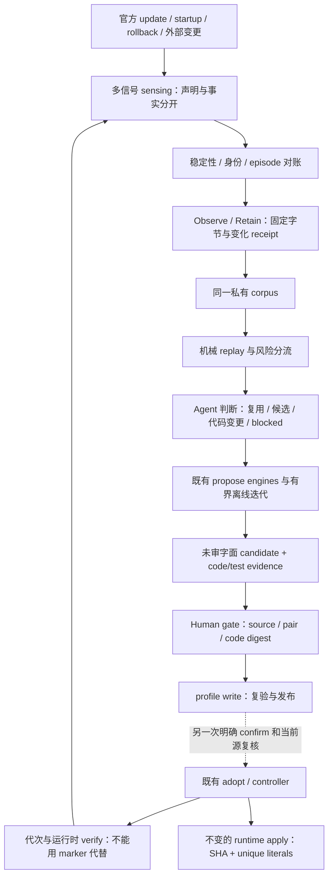

# Host seam 升级识别与运维方案

> Publication note: operational identities below are synthetic examples. Private evidence locations and machine execution records are not distributed; historical observations do not qualify a current deployment.

**2026-09-12文档分流：** 本页是已有provenance/profile工具的专题合同，保留原路径及HSO引用，不与普通未来候选一起复制/迁移。哪些子能力已实现由source/tests说明，未实现的HSO阶段不自动进入当前主线。通用单盒运行/归属变化的持续采集、SQLite与incident归[T41](../tickets/T41-continuous-observation-and-alerting.md) / [Spec S0.1.4](box-runtime-impl-spec.md#continuous-observation)；HSO保留自己的source/profile/replay证据writer，T41仅引用安全结果，不复制另一套源码库或自动发布/领养。Web UI及多盒呈现归[future](future/README.md)，不把它们提前铺在本页。

**状态：前向目标方案，尚非实现或部署完成声明。** 本文是官方 Host 升级后「保留证据、重新识别补丁点、审核并发布 profile」的方案主页；不替代运行时设计、D2 裁决或已有 adopt 授权。后续实现以本文的 HSO-0…HSO-6 交付，历史 T1 的 done 状态不重写。

**默认分工：runtime 只精确应用；ops 感知变化并做机械判断；Agent 解释证据并提出/验证改动；Human 批准发布语义；adopt 另行确认。**

**2026-09-16 狭窄扩展，尚未实现：** [Template Ops 决策](../decisions/2026-09-16-template-ops-automation.md)接受由官方模板 Bot 的原生 Webhook/Payload 接收告警与有界诊断；[专项 Spec §6](template-ops-automation-spec.md#policy)为指定低风险动作类增加可撤销预授权，允许已经资格化组合的对齐及满足已审核等价规则的新 SHA profile 派生。它不是让 Agent 自批 recipe 或把旧批准直接继承到新 source；profile 发布与实际 adopt 仍分开验证。本文后续 Human/adopt gate 是未进入该限定政策的默认路径，T43–T50 实现前现有 CLI 权限保持不变。来源 writer/证据树仍归 HSO，T41 与 Bot 只消费安全结果，不新增源码库或 controller。

唯一智能闭环是：**官方更新/换代信号 → 稳定性与身份核对 → retain/replay 机械判断 → Agent 判断 → grokbox 候选或代码的有界迭代/离线验证 → 人工 gate → 独立 adopt/verify**。升级感知是原 HSO 链的上游，不另建升级器或平行方案，HSO-0…6 编号与职责连续。

Inputs：
- 本机 survey：`PRIVATE_EVIDENCE`；任务背景：`PRIVATE_EVIDENCE`；原方案收据：`PRIVATE_EVIDENCE`。升级机制核对收据：`PRIVATE_EVIDENCE`。均为来源记录，不是公共 build/test 所需文件。
- [T1 provenance](../tickets/T1-host-provenance.md)、[T7 官方 replacement](../tickets/T7-wait-official-replacement.md)、[D2 patch surface](../decisions/2026-09-08-host-seam-normalization-and-roadmap.md#d2--evidence-bounded-host-patch-surface)、[运行时设计](../box-runtime.md)、[实施规格](box-runtime-impl-spec.md)。
- 源码基线：`pre-publication-revision`；[LIVE slices](../../packages/box-runtime/src/internal/host/live-slices.ts)、[profile/apply](../../packages/box-runtime/src/internal/host/profile.ts)、[compile hook](../../packages/box-runtime/src/internal/host/compile-hook.ts)、[profile writer](../../packages/box-runtime/src/internal/process/profile.node.ts)、[provenance IO](../../packages/box-runtime/src/internal/io/provenance.node.ts)、[公开 CLI root](../../packages/cli/src/commands/runtime.ts) 是当前实现事实。

## 1. 问题与边界

官方升级后，最常见的结果应当仍是安全拒绝，而不是勉强注入。要降低的是在大 CJS bundle 中重新找到两个正确位置的人工成本，同时防止**给错误位置制作了一个机械上完全合法的新 profile**。

这两个风险不同：
- **False miss / multi-match**：SHA、anchor 或 find 不匹配，runtime 拒绝；ops 应给出可定位的失败证据。
- **Authoring wrong-site**：新 SHA 上错误字符串也可能唯一，`profileFromSource` 也能算出 transformed SHA。SHA 和唯一性不能替代位置的语义审核。

运行时保持以下不变量，不加入识别策略：
1. `LIVE_SLICE_PATCHES` 保留为已批准的字面 recipe；`PatchProfile` 的合法集合以当前 `profile.ts` schema/validator 与实际 profile 为准。本文 HSO knife 检查围绕 `create-session`、`agent-id` 两个位置，属于专项证据，不再把历史「仅两个 SlicePatch」当成完整运行时限制，也不能据此声称检查了全部生效切片。
2. `applyPatchProfile` 先验证整个 `sourceSha256`，按切片顺序在当前字符串上验证 start/end anchor 全局唯一、find 在 `[start, end)` 内唯一，最后验证 transformed SHA。失败码和拒绝行为不放宽。
3. `_compile` / preload 只消费已审、已固定的 profile，对正确目标文件应用现有精确变换。不得解析 AST、扫描 corpus、排名候选或重写 profile。
4. 不能匹配时不做 grokbox 变换；这不是 managed routing 成功。保留既有原字节路径、拒绝信息和 coverage/窗口语义。

不在本方案内：改 Host Agent loop、TURN/STEP 定义、root/compact、工具、Memory/Transcript、SendToUser、官方 renewal；修改 provider 凭据；从档案恢复或执行 Host；自动修复 circuit/attestation；以 ops 验收代替 live canary。扩大当前已批准补丁点集合或修改语义，必须另走 D2 明确批准及 schema/validator/tests，不能藏进候选生成；低风险预授权不批准新的 recipe 语义。

### 1.1 官方更新机制与事实边界

以下是 2026-09-10 对当时安装的 Host、`sand-supervisor.mjs`、启动/监管脚本的**条件性源码事实**，不是一次实际升级的成功证明。`host-upgrade` extension / `HostUpgradeService` 注册在 Host CJS 中，不应从物理 `extensions/` 目录有无同名文件推断能力。API/路径/默认值一旦随上游改变，要重新资格化 sensing adapter；详细定位与文件 hashes 留在本机收据。

- Host 的 `updateHostNow` 负责解析 channel pointer、先取 archive digest 再下载 tgz、原子 stage bundle，最后写 supervisor command；`started:true` 只表示已 stage，不表示 swapped/ready。
- channels 为 `latest|stable`，未知/空配置归默认 `latest`。默认公开来源为 us-east-1 的 `public-asphr-vm-daemon-bucket` / `sand-host-bundle`；channel 的 `.version` 指向版本化 `.tgz` 和 `.sha256`。Host 读 live release config，supervisor boot-fetch 读自己的 channel/env 配置；不假设二者永远一致，不让 grokbox 改 channel 或主动下载来“探测”。
- 入口 `/home/box/sand-host/host-main.cjs` 与旁边 `version` 是不同观测。本次 version 文件值为 `bb6a405`，只是日期快照。**release/version tag ≠ tgz SHA256 ≠ entry sourceSha256 ≠ 已加载 Host generation**；同 version 也可能改 bytes，同 entry SHA 也可能换 companion files。
- stage 是 `/tmp/sand-supervisor/incoming-host-bundle.tgz`，command 为 `command.json`，常见 `{id:upgrade-<version>,kind:upgrade,mode:bundle,version,sha256,issuedAtMs,forceNow,reason}`。supervisor 校验 archive digest、staged entry/version 后，按 **entry → 其他 bundle entries → version 最后** 发布，不是整个目录一次原子替换。中途失败可能 `mutated:true`，即 entry 已新而 version/其他文件尚旧；不能因 failed marker 就声明磁盘未变。
- `updateHostNow` 的 `force` 默认 **true**；对应 `manual-update-host`，`force:false` 对应 `manual-update-host-idle`。busy/unknown 时 force 或默认约 6h defer 阈值会请求 Host `/prepare-upgrade`，仍须 `runningTurns===0` 才继续；阈值可配置、暂停可失败，所以 **6h 不是完成 SLA，也不是无条件强杀**。非强制请求超过阈值也可能进入该暂停流程。
- `.sand-host-upgrade.json` 位于 `/home/box/sand-data/`，记录 applied/failed 声明；applied 写于新 Host 就绪之前，还可能随后 rollback。Host 在身份就绪后转发并条件删除 marker，迁移/恢复流程还可能临时保留它。它不是 append-only 完整历史，缺失不证明没升级。`acks/` 也只表示 command 已处理，不证明当前 bundle 健康。
- `getHostStatus` 返回缓存的 `hostVersion/latestHostVersion/hostUpdateAvailable`、busy 与可选 capabilities；读取它不强制刷新远端 pointer。版本 fetch 有约 10min cache，默认 Host watch 是 24h、首次随机延迟、后续约 ±50% jitter，live config 可在 10min…7d 内调节，dev override 可不同。不能把 RPC 响应时间当 pointer 的更新时间。

### 1.2 触发分类：谁发起、谁真正改盘

表中「源码已证」均指上述受核对实现及其前置条件成立；不代表这些路径已经在本机触发。没有覆盖到的外部行为必须保留 unknown。

| 触发/路径 | 实际行为与条件 | 改 Host 磁盘 / 证明边界 |
|---|---|---|
| 客户端 RPC `updateHostNow` | Host fetch/stage → supervisor command；force/idle 两种意图；in-flight、无 source、already-latest、ack-veto 可拒绝 | **源码已证** bundle swap 路径；RPC accepted 不是 commit |
| `idle-auto-update` | Host shared watch，auto-update 未 opt-out、目标不同、未重复 stage、未 veto 时 fetch/stage；idle 在 supervisor 端最终判断 | **源码已证**，不依赖桌面 App 常驻；不是看到 available 就立刻换盘 |
| channel/pointer 改变 | live channel config 或远端 pointer 变更由下次 watch/manual check 发现；版本比较是不同而非 semver 升序 | 可能升级或降到较旧 tag；**来源原因需观测**，不能假设版本单调 |
| fetch/stage 失败后重试、failed-swap re-stage | 失败的 fetch 可在后续触发再试；相应 failed bundle marker 可释放 staged 状态，现有内存策略至多两次 swap re-stage；post-swap crash-loop 排除 | **源码已证**条件分支；manual re-poke 与自动 budget 不混为一次永久去重 |
| supervisor 直接接收 upgrade/bundle command | 不要求经过 Host RPC；合法 staged 路径、digest 等仍由 supervisor 校验 | **源码已证 consumer**；谁在外部写 command 未穷举，归因 unknown 时仍能检测换盘 |
| supervisor startup `boot-fetch` | Host supervision 开、未 opt-out、bundle 存在且 local version 等于 image SHA，启动时按 channel 查 pointer；默认约 20s 网络预算及 backstop | **源码已证**，可不经 command.json 直接 swap/ack/marker。不是每次 Host restart 都下载；缺 bundle/version/image SHA 不自动修复 |
| swap 途中失败 | entry 已提交而 companion/version 失败；boot-fetch 路径可尝试恢复备份，普通 command 失败不能据泛化日志断言未改盘 | **源码已证**部分更新可能；视为 unsafe/mixed，重采样而不是发布支持状态 |
| post-swap crash-loop rollback | 当前 supervisor 进程内监控新 Host：默认短于 60s 的三次 quick exit 触发备份恢复，恢复最多尝试五次；达到健康窗口后解除监控 | **源码已证**会回写旧 bytes；阈值可变，监控不是跨 supervisor restart 的持久合同；rollback 失败仍可能 mixed |
| rollback/ack veto | 本地已 ack 的 `upgrade-<target>` 而 local version 不等于 target，Host 返回 `host-version-rolled-back`，boot-fetch 也可 veto | **源码已证拒绝门，不是写盘触发**；ack 存在本身不证明发生过哪一种 rollback，grokbox 不清 ack 绕过它 |
| Host crash / supervisor restart / orphan adoption / restart command | 普通 crash/backoff、`restart` 或 upgrade/restart 主要重启现有磁盘代码；监管脚本可重启 supervisor，后者可重新发现孤儿 Host或满足条件时 boot-fetch | **源码已证代次变化**，本身不等于 source 改变；PID 变而 SHA 不变仍要核对 patch activation |
| upgrade/image command | 本地 supervisor 停/重启当前 Host、等待外部 recreate 语义，不执行 bundle-mode 的换盘 | **源码已证 mode 分离**；image command ack 不证明 image/pod 已替换 |
| `updateForeverBox` / `resetForeverBox` / `autoUpdateBoxNow` | forever-box 经 box-lifecycle 调用 backend `recreateSandBox`，preserve/reset 语义不同；autoUpdateBoxNow 是 in-box pre-hibernation image check/recreate 路径 | **本地 RPC handoff 已证**；实际 backend image 选取/部署未核验，可能带来 image-baked Host，再触发 boot-fetch，不能称同一个 Host bundle swap |
| 后台 image-auto watch | service 有 image polling/auto-recreate 分支，但在当前 extension 配线中 host-bundle auto-update 启用时会抑制它；当前开关组合不证明它会自动 recreate | **有条件源码，非本机已发生事实**；不要从同名 auto-update 推定所有车道同时启用 |
| box/container recreate、重新启动、平台替换 | 启动脚本消费已提供的 Host、可 copy-in 产品数据，再启动 supervisor；home snapshot 排除/保护 sand-host | **本地启动链已证，外部镜像写入链未知**；copy-in 不能被当成已证明的 Host restore 来源 |
| “crash remount” / App 崩溃后重建 box | 本地查到的是 crash marker/telemetry、进程 backoff、post-swap rollback、显式 recreate client | **未证明 crash→backend remount→新 image 的自动因果边**；持续监听 filesystem/PID，归因保持 unknown，不把同名 remount 文本当证据 |
| App 自身更新 / 外部运维写入 / helper-only 更新 | 可能调用 RPC或由其他组件换盘；本次没有 desktop updater/broker/server 完整源码证明 | **未知外部 trigger**；被捕获的未归因 entry/version/helper/component 变化均进入同一 sensing 链，暴露漏观测窗口，不编造 actor |

### 1.3 App、Host 与基础设施的责任

Host bundle channel 配置与 desktop App release-track 配置在源码中是分离的；Host 自有 watch 和 supervisor boot-fetch，故 App 更新**不是 Host 更新的必要条件**。本次只能证明客户端能调用 Host RPC、消费版本状态；未检查 desktop updater 的发布 hook，不能断言「App 一更新必然更新 Host」，也不能证明所有 App 版本都只展示状态。App version 变化只能作为 advisory trigger，Host 是否换盘仍以本机证据确认。

`autoUpdateBoxNow` 属于 forever-box/image recreate，不等于 `updateHostNow`。`isAllowedReleaseDownloadHost` 属于 plugin GitHub release asset 下载，不是 Host 的 S3 bundle 路由。bundle 的 box-scripts 同步排除了 supervisor/启动监管等核心脚本；因此 helper-only 改动还需独立感知，不能假设都随 Host entry SHA 一起升级。grokbox 不接管这些官方更新职责。

## 2. 分层与能力隔离



| 层 | 唯一职责 / 可用能力 | 明确没有的能力 |
|---|---|---|
| Runtime apply | 目标文件、固定 profile、精确字面应用和 compile receipt | parser、corpus、评分、候选发布 |
| Upgrade sensing | 本机文件/生命周期线索；可选已授权的只读 Gateway status；写 ops 事件/对账索引 | updateHostNow、autoUpdateBoxNow、写/消费官方 command/ack/marker、借探测发升级请求 |
| Observe/retain | 只读源文件；写 protected provenance、观测指针、切片证据 | signal/spawn Host、adopt、凭据、attestation/circuit 写入 |
| Replay | 验证档案完整性；运行纯字符串 apply；写派生 replay 报告 | 执行 bundle、发布 reviewed.json |
| Propose engines | 候选枚举、结构/邻域分析、字面切片生成 | 自动选中、自动批准、执行候选 replacement |
| Agent analysis / offline iteration | 基于有界证据做 triage；在另获代码写权限的隔离工作面修改 grokbox并运行离线 gates | 将 Agent verdict 当 Human approval、把私有 Host 搬入 repo、自动部署/adopt |
| Human gate / publisher | 审核特定 source+pair+digest；调用唯一 profile writer | 将分数或一条成功测试当 live 授权 |
| Adopt | 现有独立确认、身份/源/profile/拓扑等预检及控制程序 | 从识别状态自动获得授权 |

实现落点：CLI 只做参数路由、结构化输出及 lazy loading；新增 ops 编排位于 `packages/box-runtime/src/internal/ops/host-seam/`（目标路径），复用现有纯 profile/hash 规则及 IO adapter。parser 只由 ops worker 加载。重 IO、worker lifetime、锁及取消按 [Effect 标准](../effect-box-runtime.md) 收口；纯 shape/fingerprint/score 使用普通 TS。不得让 `host/` 或 modeld 因此依赖 ops。npm 仍只发布 `grokbox`，`gbox` 仍为同义 alias，不新建可安装产品。

## 3. Observe/retain：升级感知接到同一证据链

### 3.0 感知优先级与 source registry

按**确认 Host 字节变化的可靠性**排序；完整系统同时使用前兆与结果信号，不把排名最高的传感器当唯一传感器。

| 优先级 / sensing point | 能证明什么 / 不能证明什么 | 稳定性、误报、权限、延迟 |
|---|---|---|
| 1. 安装目录/父目录 watch + entry/version 的 fd/stat/SHA + 定时 backstop | 最终字节真相；跨 RPC/boot/rollback/外部写入都有效。不能单凭一次 entry hash 证明整个 bundle 已完成发布 | 低权限本机读；监听目录而非只盯被 rename 的旧 inode；FS 事件可丢/合并，必须 poll/hash 对账 |
| 2. supervisor command/status/acks 与 allowlisted boot-fetch telemetry | pending/staged/idle defer/command 消费/boot-fetch 的时间线；不能把 ack 或 pending=null 当健康 commit | 本机只读，较早且可解释；路径/schema 私有且 status 周期性、command 单槽可覆盖，restart会丢进程内状态 |
| 3. upgrade / crash marker | declared applied/failed/exit 类与 operation/version 关联；failed 可能已改盘，applied 可能未就绪/稍后回滚 | 本机低权限；marker 会被官方转发删除，watch+poll仍可能错过；不删除、不 ack，不把 absence 当否定证据 |
| 4. 只读 `getHostStatus` | 客户端可见版本、available、busy/capability 提示；不保证 pointer 新鲜或安装完成 | 需既有受控 Gateway capability；缓存可能很旧、Host down 时不可用；不读/输出裸 gateway.json token，不以 updateHostNow 强刷 |
| 5. Gateway PID/start + T7 官方 replacement 身份核对 | 服务由哪个存活 Host 发布；进程代次是否换了 | 必要的 activation 交叉核对，不证明升级原因/loaded bytes；同 SHA restart 也触发，PID reuse须看 start，Gateway发布有延迟 |
| 6. App/image/外部告警提示 | 提醒 resense、发现潜在失联/换机 | 外部依赖和语义不稳定；无本机佐证则 `attribution:unknown`，不能直接触发 profile/adopt |

注册表固定每个 adapter 的允许路径/RPC、schema版本、验证过的上游 source/helper digest、 freshness budget、能力需求和失败类别。未识别 helper/schema 触发 `sensor_contract_changed`，降级到本机字节核对，不去解析 arbitrary logs 或强行沿用旧解释。明确区分 `unavailable/unauthorized/absent/stale/invalid`；getHostStatus 的 observedAt 只代表读取时间，不伪造其内部 cache 更新时间。未证明有专用 Host-upgrade SSE 订阅，初版只用可验证的只读 polling，不 monkey-patch RPC/Host。

初始 ops 策略：目录事件合并约 250ms；正常每 30s 核对文件 metadata、每 60s 做 hash backstop；启动/重连/watcher overflow/PID换代必须完整 resync。transition 期间可每 1s 读取有限 metadata，重 hash 由 dirty 标记驱动而非无界并行扫描。Gateway advisory poll 默认不快于 60s且可禁用；失败不重试成更新 RPC。这些是 **grokbox 目标预算**，不是官方 updater 的时限或无丢事件保证。

### 3.1 一个 provenance writer，多个 sensing 入口

建立 `observeHostProvenance` 用例：**汇聚信号 → 一致性分级采样 → retain → 精确 knife-point observation → 发布观测 receipt**。sensing 不等待重型 AST/Agent工作完成；新证据先入有界队列，任务消费固定 snapshot。

- 新 `runtime profile observe --from <abs>` 调用它，适用于离线文件和显式运维采样。
- 新 `runtime profile watch` 是有界资源的长期 ops root，承载目录 watch/poll/resync、episode reducer 和去重任务队列，并调用同一 writer；不是另一个 Host 更新器或进程 controller。root lease 保证同一 box 不重复派发重任务；one-shot observe/watchdog 仍可经相同 writer lock 对账。
- 既有 `runtime watchdog run` 的真实 composition root 在 reconciliation 前调用同一用例；inhibit/circuit open 不阻止这个无进程动作的 provenance 阶段。receipt 保留原 control outcome，另加 provenance 子结果；capture 失败报告整体 partial/非零退出，但不改写原 control 事实。观察失败不能制造收敛、清 circuit 或授予后续动作。
- `runtime status`、`runtime contracts`、`runtime profile status` 仍为只读：缺树就报告 missing，不偷偷 capture、prune、replay 或 repair。
- 从旧 `internal/process/watchdog.ts:observeAndHeal` 中迁出 **retention/snapshot 能力**，而不是重新接回整个旧函数。旧函数包含 `signalIfMatch` 等动作，不得拿它闭合新的 observe 路径；公开入口必须在不提供这些能力时也能完成 retain。
- 不因 controller 的同 operation receipt 吸收重复请求而漏掉下一次磁盘采样。provenance 采样位于该控制去重之外，但仍在同一命令 Scope 内；它不是第二个 controller。

### 3.2 采样、寻址和写入规则

1. 显式绝对路径、允许的源根、regular file、无路径穿越；不接收代码字符串、stdin bundle 或 URL 下载作为隐式来源。
2. 固定 fd 后读取有界原始 bytes；核对读前/后 fd 身份、长度与版本信息，并复核 pathname 未换代。源变动报 `source_changed`，不把混合字节发布为一代。仅以实际采到的 bytes 计算 SHA；不信任 caller 传入 SHA。
3. UTF-8 必须可无损往返，保留 BOM、hashbang、CRLF 和全部空白。无法往返报 `unsupported_encoding`；不先格式化再取 hash。上述完整性模型针对正常升级/并发故障，不声称防御同 UID 恶意篡改文件、时间信息或审核记录。
4. 用 root-scoped provenance 锁及唯一 staging 写 `0700` 目录 / `0600` 文件，完整读回、hash/sync 后发布 generation，再原子更新 HEAD。已有 SHA 的 source 不可覆盖；已有 bytes 不符即 `corpus_corrupt`。
5. HEAD 只是「最新完整观测」指针，不是当前 live 内存代次，也不是当前适合 adopt 的声明。分别记录 `entryIntegrity` 与 `installationConsistency`：fd 稳定的 entry bytes 可留作 transition/rollback 取证，但混合安装快照不推进 stable-installation 指针。缺 meta/profile 或中断 staging 保留为 partial，status 不修复；下一次显式 observe 可以重建可验证的派生 metadata。
6. 同 SHA 重复 capture 不重复写完整 source；matched profile 的后续证明存为独立内容寻址引用，不靠重写 source 或不可信 `matchedProfileId` 字符串升级支持状态。

私有根布局（逻辑约定，新增子目录由对应 phase 实现）：

```text
<boxRoot>/
  host-bundles/
    HEAD
    generations/<sourceSha>/source
    generations/<sourceSha>/meta.json
    generations/<sourceSha>/diff.json
    profiles/<profileSha>.json       # 已发布 profile 的不可变 replay 副本
    reviews/<reviewDigest>.json      # 人工审核记录；不是执行授权
    replay/<inputDigest>.json        # 派生结果，可失效重算
    ops-events/<segment>.ndjson     # 有界分段 allowlisted sensing/analysis receipts
    ops-state.json                  # episode/cursor/task index；可由完整 receipts 对账重建
  contracts/                        # 辅助 contract windows；独立于两个补丁点
  profiles/reviewed.json             # 唯一当前可安装 profile
```

candidate artifact 存到显式指定的受保护私有路径，不自动放入 `profiles/`。整包只属于 `host-bundles/`；profile authoring/launch 不另造完整副本。合同切片保留与完整 provenance 保留是两种政策：不能用「只留切片、临时整包用完丢弃」否定 T1 的正式档案树。

### 3.3 KEEP 与保护

- 沿用 **KEEP=16** 的 active generation 目标；至少保护当前观测的磁盘 SHA、可信记录指向的仍运行 Host 源 SHA、最近一个已审且 replay 匹配的 SHA。
- 同时保护正在 replay/propose/review 的 source、baseline 和其必要 profile 副本，以及未结束 upgrade/rollback episode 的前后源。任务获得有界 read lease；人工 pending review 使用显式 pin，不能靠 mtime 猜仍在使用。官方 `.prev` 的存在/删除不控制 grokbox corpus 保护；按 entry SHA 自己保留证据，不读写官方备份来修复。
- 保护集合优先于数量。受保护代数超过 16、保护事实未知或容量不足时，报告 `retention_pressure` / `cleanup_deferred`，允许暂时超额；不淘汰保护代来伪装 KEEP 成功。
- 按观测顺序与 SHA 稳定排序，只选择未保护旧代。observe 可产生 `retentionPlan`（plan digest、观测版本、保护集合、拟移出 SHA/bytes、原因）；执行必须显式 `profile prune --plan <abs> --confirm`，在同一 provenance 锁内复核计划 digest、当前保护集合与 read leases，变化即 `plan_stale`。
- 遵守执行环境安全删除政策：默认只留计划；只有已授权且已验证的 trash/recycle 路径才能执行移出，不沿用裸 `rm`。trash 失败保留源，不能报告已清理；未知或 protected 目标禁止移出。receipt 记录 active 集合变动，不能把 trash 中字节当可用 corpus。只读命令永不清理。
- archive 的存在不授权恢复、注入或执行其 source。所有 retained source、片段、候选和本机路径均禁止进入 git、npm tarball、公共 CI artifact 或常规日志。

### 3.4 换代 barrier：不在 mid-swap 或 staging-only 上打补丁

保留四个独立元组：`advertised(version/channel)`、`staged(command/archiveDigest)`、`installed(entrySha/version/companionDigest)`、`loaded(hostPid/start/compileReceipt-or-unknown, gatewayPid)`。archive digest 与 source SHA 不互换；version 或 PID 单独变化不触发“已安装新代码”的结论。

- pending command、stage/rollback目录活动、entry/version 不一致、source在读中变化、upstream failed 且是否已改盘未知，均置 `installationConsistency:transition|mixed|unknown`。record/capture 可以继续，live publish applicability/adopt eligibility 必须保持 blocked；不得调用官方 pause/upgrade 来取得静止窗口。
- 安装快照至少需要两个相隔 debounce/settle budget 的一致 fd/hash/version 观测，并核对可用的 supervisor/marker/companion metadata。同一次 entry-first/version-last 发布中的混合状态不能拼成一个 bundle。输入不支持完整 manifest 时保留 `companionCoverage:partial`，不把 entry-only证明说成全包完整性。
- supervisor applied/ack、version 相等、status.hostRunning 都不是 T7。新 Gateway 必须对应同一存活 Host PID/start；loaded SHA 只有可信 compile/source receipt 才填，不能用当前磁盘 SHA 倒灌旧内存代次。只换 PID而 SHA 不变走 activation verification，不重复 re-author。
- 当前 supervisor status **没有显式 swapInFlight/postSwapRollback/bootFetch phase**，pendingVersion 还可能在磁盘 version相等时提前清空；不得凭 absent字段认为安全。rollback观察窗的有效配置/存活监控若不可得则 `rollbackRisk:unknown`；静态分析可进行，adopt 不自动放行。需要人工处理的 evidence gap 明示，不把“等默认60s”当排他保证。
- 任何 sense 新证据均可取消旧 eligibility。任务使用不可变 snapshot + episode/revision fence；A→B→A rollback是新的安装 episode，可复用 A 的机械 cache，但不能复用 A 旧的 activation/授权时效。review/write/adopt 前再次比较目标快照，变化即 `superseded/source_changed`。
- grokbox 的锁不能锁住官方 supervisor。稳定采样只是观测，不是跨 writer 排他协议；在现有另行确认的 adopt 预检边界拒绝已知 transition，并保留原始实时 source/compile checks，应对最后时刻竞态。不能用该方案宣称消除了所有官方换代窗口。

staged tgz 默认只读 allowlisted metadata，不作为 `--from` 现役源、不在 staging/`.stage/.prev/.rollback-stage` 上写 profile或 patch。若未来单独授权提前分析，必须用安全静态提取与独立 provenance 标记 `staged-preview`；其结果不提升 installed/support/adopt 状态。跨 companion/helper 的变化同样要感知：entry SHA 不变而 worker/extensions/supervisor digest变了，派发相应互操作或 sensor-adapter验证，不伪造需要重新找两个 anchors。

### 3.5 多触发 episode、事件与状态面

每个可感知变化先生成 **observed receipt**，不能强行补齐未看到的阶段。标准可视时间线为：

`available/pending → staged → swap-deferred/swapping → applied-reported/failed/rollback → installed-observed → retained → replay-pass/fail → agent-judged → propose/iterate → reviewed → profile-published → adopt-authorized → adopt-verified/failed`。

这些状态分属多个事实面，允许跳跃、回退、supersede及并存。`applied-reported` 是官方声明；`installed-observed` 是本机字节证明；`adopt-verified` 只来自另获授权后的现有控制/运行时证明，不能由前两者推导。

事件最小 allowlist：`schemaVersion,eventId,observerEpoch,seq,observedAt,episodeId,sourceKind,sourceRefDigest,upstreamCommandId?,upstreamIssuedAt?,mode?,triggerClass?,from/toVersion?,archiveDigest?,entrySha?,supervisorIdentity?,hostIdentity?,phase,outcome,errorClass?,freshness,gaps,workKey?,evidenceDigest?`。mode/trigger/errorClass 是固定 enum；未知归 `unknown`，不回显 raw reason/error/stderr、完整 command、token/argv、prompt/transcript/源正文。

- `upgrade-<version>` 会被重复使用，不能单独充当全局 operation identity。用观测者 epoch/seq、上游声明 fingerprint、源/进程换代证据建立本地 episode；原样保留可验证关联，不凭 timestamp接近制造因果。无法确定 actor 时 `attribution:unknown`。
- command单槽覆盖、marker消费、文件watch丢失、观察器停机、helper restart或box重建都可能漏阶段。报告 `missed_stages/observer_gap`；重启先全量只读 resync，再继续队列，不能编造 pending/staged 历史。
- 同一个 `(entrySha, companion/sensor contract digest, recipe/tool version, failure/evidence digest)` 只保留一个活动分析 workKey，事件合并、backpressure 有上限。更新的安装 revision可 supersede旧任务；旧任务仍保存结论，但不能发布给新 revision。
- 触发 work 的不仅是 source SHA：新 pointer只做 advisory、command/marker改变更新barrier、helper/schema变化做sensor资格化、PID换代做activation核对、replay/运行时互操作失败触发诊断、工具/recipe升级触发重放、人工请求触发明确范围分析。事件暴增不派出无界 Agent群。
- status 分面输出 `upstreamUpgrade`、`installation`、`loadedHost`、`provenance/replay`、`analysis`、`review/publication`、`adoptEligibility`；均有 source/version/time/freshness/gap。不得用一个绿色“upgraded”覆盖所有面。原 runtime六 facets/coverage/circuit 语义不改。
- 告警按 episode去重：新变更被看到即 notice；staging/transition超预算、mixed/source变化未保留、replay失败、Agent blocked、review待处理、adopt验证失败分别升级。展示各阶段延迟和证据缺口；alert sink须显式配置，不能拿告警当修复授权。

ops事件/任务索引仍在同一私有 provenance根，不建第二事实数据库。索引损坏可由完整 receipts重建，状态查询不修复；checkpoint、队列、watcher、worker分别受同一 root Scope和资源预算管理。gap 会降低自动推进能力，不降低 runtime SHA/唯一性门禁。

## 4. Replay corpus：两类证据，不混成一个绿灯

### 4.1 修正 observation 与 knife-point 的语义

两个真实补丁点只能由 `SlicePatch` 描述。四个旧 contract names（`create-session`、`session-options`、`agent-id`、`prompt-session`）是另一组观察窗口，不能凭同名对应补丁点。

- `patchImpact` 以 **source SHA × slice-id × recipe/profile digest** 的精确重放结果为准。
- `extractContractSlices` 的 first-`indexOf` 结果不能再产生 `patchImpact=unchanged` 或 `review=none`。保留历史 metadata 时标 `legacy-window`；缺少唯一位置/来源证明的值为 unknown，而不是空数组 `driftedSlices=[]`。
- **YELLOW：** 四窗 `patchImpact` / `driftedSlices=[]` 不是 envelope 绿。19 片窗漂是并行 `envelopeDrift`（`runtime profile status` facet），禁止扩 `driftedSlices` 到 compact-register 等 envelope id。
- 辅助 contract window 若继续输出，也须报告全部命中数与各自 selector 版本；多命中/缺失不取第一条。它们以 `contract:<name>` 命名空间显示，不进入两个 slice 的通过率。
- `lineDiffStats` 只作大小/变更量提示；common-prefix/suffix 单 hunk 不是定位器，不生成 patch。

### 4.2 每代必须输出的矩阵

对明确选择的 corpus 范围，完整列出 `create-session`、`agent-id` 两行，不因第一条失败或未知 SHA 隐藏另一条。每行至少有：

`sourceSha, profileSha/recipeDigest, sliceId, evidenceKind, sourceIntegrity, startCount, endCount, findInWindowCount, findGlobalCount, endAfterStart, locationRange, code, runtimeChecked, semanticLabelState`。

计数规则必须对应实际 apply：start/end 是**当前 pass 字符串上的全局计数**，find 只在 `[start, end)` 检查唯一，end 不含在窗口中。当前 LIVE / 新候选标准顺序为 `create-session → agent-id`；历史已审 profile 必须保持其原始 `slices` 顺序，不能重排。第一条 replacement 可能改变第二条的计数和位置。报告分别标注原始 `sourceRange` 与该 pass 的 `passRange`；golden/AST 位置始终对原始源，不能用插入后的 offset 对错坐标。ops 可补充独立诊断扫描，但要注明 `diagnosticOnly`；最终结论必须运行原 `applyPatchProfile`，trace 与其结果不一致时报 `trace_mismatch`，不能建立第二个宽松 apply。

| 证据 | 要求 | 能得出的结论 |
|---|---|---|
| 已审 profile 对自己的 retained SHA | 校验 profile 副本 digest、source bytes、完整 ordered apply 和 transformed SHA；比对独立 golden site labels | `reviewed_match`，仅静态适配，不证明 live |
| 旧 profile 对新 SHA | 原 `applyPatchProfile` 必须返回 `unknown-sha`，即使 anchors 仍唯一 | 不得继承旧批准 |
| 当前 LIVE literal recipe 对未知 SHA | 逐 id 列出精确机械结果；可以在内存算临时 profile 做纯字符串 replay | `unique_unreviewed` 或明确缺失/多匹配；不是 supported |
| candidate pair 对其 target SHA | 校验候选 digest、两个位置、顺序、唯一性和预期 transformed SHA | 机械可用、等待人工语义审核 |
| 缺 profile 副本、档案损坏、范围截断 | 记录 `missing_profile/corpus_corrupt/incomplete` | 不能算完整通过 |

失败至少区分：原有 `unknown-sha`、`anchor-missing`、`anchor-duplicate`、`find-missing`、`find-duplicate`、`slice-not-unique`、`transformed-mismatch`，以及 ops 的 `wrong-site`、`ambiguous-site`、`source_changed`、`corpus_corrupt`、`analysis_incomplete`。不要用一个“drift”吞掉它们。

**Loud fail：**目标 SHA 没有已审且机械/位置重放通过的 profile，support 就是 `unsupported_bundle`。两条 literal 都唯一、候选分数高或生成了新的 transformed SHA，都不能改成 supported。未知值不是 unchanged；空 corpus 是 `corpus_missing`，不是 0/0 通过。

### 4.3 Golden 的独立性

- corpus 保存该 SHA 当时已发布 profile 的精确 bytes/digest，以及独立审核的两个 site labels（原始 byte ranges、角色、审核来源）。profile 名称本身不构成 approval。
- golden site labels 不能由被测 matcher 自动更新。历史匹配 profile 重放失败、matcher 漂到别处、候选错误地穿过负例都使回归失败。
- 新 recipe/engine/parser 版本产生新的 replay key：`sourceSha + profile/candidate digest + tool/engine/parser/recipe revision`。不复用旧版本的绿色 cache。
- 实际私有 corpus 只做静态定位、纯字符串变换及受控语法检查，不运行 bundle。公开 CI 使用独立编写的 synthetic corpus；缺私有档案只降低真实升级覆盖声明，不阻断公共 build。

## 5. Propose engines：互补识别，输出仍是字面字符串

### 5.1 统一候选模型与执行顺序

新 SHA 默认运行 literal、fingerprint 和 structural 三类证据，合并到同一候选表；不是让三套 matcher 分别决定“正确位置”。已审 SHA 的精确 replay 已通过时，无需重复生成新 profile。

1. Literal engine 枚举当前 LIVE / 明确 baseline profile 的全部 anchor/window 命中，不取 first hit。
2. Fingerprint engine 在函数/邻域可能区域内枚举支持信号；无 AST 时只能声明 textual evidence，不能宣称命中可执行方法。
3. Structural engine 在独立 worker 中解析 CJS，给出结构候选和绑定关系，佐证或反驳前两类结果。
4. 按 source byte span + slice-id 聚合证据；仅当 bindings 与字面 patch digest 也相同时才合并候选。相同位置但不同 replacement/绑定的 variants 必须分别保留，不能 first-wins。生成有限的两切片 pair，验证其上下文关联、范围无冲突及完整精确 replay。
5. rank 只改变呈现顺序。没有“最高分自动选中”，也没有分数阈值自动批准。

baseline 是明确的 retained SHA 与其已审 profile；不默默挑一个看起来最近的版本。无 baseline 时标 `baseline:null`，仍可从当前 recipe/结构规则提供人工候选，但不能声称历史连续性。

### 5.2 `create-session` 的结构形状

定位角色是 **inference options 对象上的同步 session factory 方法入口**，不是任意叫 createSession 的函数、调用表达式、字符串或文档片段。

具体规则：
- 枚举对象成员中的方法 / 函数值属性，关注两个参数槽位：request-id callback 与 session options；追踪这两个参数在方法体内如何进入官方 session 构造路径。名称是证据，不是 AST 身份。
- 同一对象的 sibling 方法形状为支持信号：例如单参数的 post-turn labeling 操作。`recordPostTurnLabeling` 的拼写和紧邻关系权重较高，但不是必须的绝对行序；无关 sibling 重排不应丢掉对象归属。
- 官方 model/client/session 初始化路径与返回 session 的结构为角色证据。`createCursorInferencePromptSession` 等名称仅加强证据，不要求整段方法 AST 精确相同。
- 参数名重命名可通过 lexical binding 映射为实际 callback/options 标识符；不能从“某个二参函数”直接推断参数语义。成员名、整个 sibling 家族或调用合同同时改变时，保留候选但要求人工重新证明角色。
- 自动字面 recipe 只覆盖可明确绑定的同步普通参数形状。async/generator、rest/destructuring/default 参数、computed key 或包装层变化可被识别为候选，但不猜如何改签名；标 `unsupported-binding-shape`，交人工处理，必要时走 D2。

插入点必须在该方法的 directive prologue **之后**、第一条官方 provider 初始化语句 **之前**；不能破坏 `"use strict"`，不能再次退到 factory 调用之后。生成时使用当前源码实际参数标识符，并检查插入临时变量的 scope collision。guard 只做既有 route hook 调用，非 `undefined` 返回即接管，`undefined` 继续原官方 body。不得执行官方 factory 才决定是否 managed。

### 5.3 `agent-id` 的结构形状

定位角色是 **普通 main TURN 构造、随后传入上述 session factory 的 options 对象**，不是第一个 `agentId: host.getConversationId()`。

具体规则：
- 找到绑定到局部变量的 `ObjectExpression`；关键 field shape 是模型选择项的值来自同一个 Host 对象的成员（现役例子为 `modelId: host.subagentModelId`）。不要求变量叫 `mainSessionOptions`，也不要求该字段排第一。
- 在同一词法作用域追踪该对象绑定，确认它作为 session factory 的第二实参使用，例如 callback 内 `host.inference.createSession(callback, options)`。允许 callback/局部变量改名；不因距离变远或无关声明重排丢失 def-use 关系。
- main TURN 归属、第一实参 callback 来源、同一 Host receiver，至少由作用域/调用位置和独立邻域证据共同确认。只有同名 getter 或 options 字段不足以排除后台 shell/subagent 路径。
- 要插入的 agent 表达式来自这个 Host 的已知 Agent 身份能力；TURN 表达式来自 **已有 TURN binding**。确认初始化在对象求值前、作用域一致、非 STEP callback id，不能把任意 UUID 变量当 TURN，更不能生成新 UUID。
- 对发生遮蔽、复杂控制流、getter/computed property、重复 identity 字段或可覆盖字段的 spread，报告绑定/覆盖顺序风险；不通过简单“名字相似”把它消掉。不能证明的 pair 不得发布。

字面 replacement 只插入 `agentId` 和 `invocationId`，保留原模型字段及其他 options 字节与求值顺序。已经包含注入字段/route guard 的源码不能再自动插一次：标 `already-patched-or-contract-changed`，重新审核其合同。

### 5.4 韧性与 parser 失败

| 变化 | 可保留的证据 | 必须降低的声明 |
|---|---|---|
| 空白、换行、注释、minify | AST 结构、作用域、参数槽位、对象字段/调用关系 | 旧 literal 往往失效；重新切取原字节 |
| 局部变量/参数改名 | lexical binding 及其 def-use | 名字指纹失效，不能借旧名字生成 replacement |
| 无关方法/字段重排 | 同一对象成员集合、options 到调用的关联 | “紧邻/第一字段”加分消失 |
| 公共成员/字段改名、签名或控制流变化 | 部分 shape、位置候选 | 不保证语义存续；manual review / D2，而非自动兼容 |
| 多个同构方法/对象 | 全部候选与各自调用邻域 | 不可把 best-of-N 改叫 unique |
| parse error / timeout / OOM | literal 与已标注为 textual 的 fingerprints | `structural: unavailable`，不是无候选或已证明正确 |

选用一个锁定版本的严格 CJS parser（实施默认 Acorn），在 ops worker 中运行；grammar/options 与 parser 版本进 receipt。不得使用宽松 error-recovery AST 当证明。可支持 CJS hashbang/顶层 return 等明确语法，不能执行 module 来“帮助解析”。

parser 失败时保留 literal/fingerprint 候选、失败位置类别与 `syntaxUnverified`；不得静默轮换 parser 直到某个结果好看。人工仍可在明确 limitations 下审阅 literal 候选，结合目标 Node 的 **syntax-only** 检查及 synthetic replay；无法证明语法/位置就保持 blocked。`node --check` 仅可在有界 owned worker 内使用，不能替换为 require/import/vm/`_compile` 执行真实 source。

AST offset 通常是 UTF-16 code unit；候选 artifact 统一使用 **原 UTF-8 byte range、end-exclusive**。必须验证双向映射和 substring hash，不能把 AST offset 直接作为 byte offset。最终字符串始终切自原 bytes，不用 pretty-printer 重印 Host。

### 5.5 多信号 fingerprint 与评分

使用版本化、可解释的四组信号；同源信号在组内封顶，避免把同一个名称的 regex、token 和 AST 三次计票。

| 信号组 | 满分 | 例子 |
|---|---:|---|
| 局部调用/绑定关系 | 35 | options 流向目标 session 的第二实参、callback/Host/TURN 同作用域 |
| 方法/对象 shape | 25 | 二参同步成员、参数用途、模型字段与成员访问结构 |
| 邻域角色 | 20 | 同对象 labeling sibling、main TURN 周边调用族；紧邻只是增强项 |
| 字面/归一化 token 指纹 | 20 | 稳定属性/短字符串、去空白 token n-grams、标识符角色归一化后的局部摘要 |

每项输出 `signalId, group, matched|missing|contradiction, contribution, evidenceRange`。短字符串不是唯一方法；AST 也不是独占识别器。硬矛盾（后台路径、错误 options 绑定、TURN 未初始化、重叠修改、语义无法保持等）不能靠分数补偿。

排序为 score 降序，再按 byte range / candidate digest 稳定排序；tie-break 只保证可重复输出。必须同时显示：结构候选总数、保留/截断数、每组证据、精确 anchor/find counts，以及 pair 的完整 replay 结果。一个候选的 anchors 唯一，不等于语义候选只有一个。多角色候选的消歧须有人工证据；若实际上需要多处 factory 都打补丁，则现有两切片合同不够，不能偷偷只选一处。

### 5.6 预算

初始 ops envelope：source ≤64 MiB；单次 parser worker 45s、heap ≤1536 MiB，平台可用时另限 RSS 2 GiB；同时最多一个 parse worker。超限明确失败，不拆片伪造完整 AST。

候选最多每 slice 16 个、pair 16 个；单个 anchor/find/replacement 各 ≤8 KiB；每个 review context 前后各 ≤512 UTF-8 bytes；candidate artifact ≤1 MiB。minified 单行不突破 byte 窗口。超出任一限制设 `truncated/analysis_incomplete`，展示结果也不能成为发布依据。要扩大限制，须重新跑预算 fixture 并记录新策略版本，而不是静默截断。

worker 使用显式、最小环境及 private cwd；清除 `NODE_OPTIONS`、额外 loader/preload 注入和 `GROKBOX_ALLOW_LIVE_HOST` 等 live 开关，不继承 provider/Gateway/daemon 凭据。语法检查不能因继承 require hook 而执行别的代码。worker 只读固定输入、写私有派生文件，无网络与 Host mutation capability。

超时必须终止并回收 **owned parser/check worker**，不是对现役 Host 发信号；报告 worker exit/signal、峰值内存与耗时。Promise.race 不代表同步 parse 已停止。缓存只在完整输入 digest 相同时有效。

sensing 单事件 ≤4 KiB、active episode/task ≤32；单个 ops event segment ≤1 MiB，active segments 目标上限16。只记录变化而非每次 poll重复落盘。未结束 episode/审核证据须保护；空间压力通过显式安全 prune/archive计划处理，不自动永久删除。无法保存事件时公开 `observation_gap/storage_pressure`，停止自动派发/推进而不伪报完整历史。Agent每 root最多一个活动工作，初始上限两轮 edit/verify、15min墙钟预算；还须有已配置 runner 可执行的 token/step上限，无法强制预算或隔离权限就不启动。

### 5.7 机械判断 → Agent 判断 → grokbox 迭代/验证

这三个步骤解释同一 snapshot，不是互相投票。机械层先输出 exact replay矩阵、稳定性/新鲜度、独立 golden差异、候选数量/绑定风险和失败类别；Agent必须引用这些结果，不能把自己的高置信度覆盖机器拒绝。当前 `unsupported_bundle` 不是调用自动 adopt 的信号。

| 机械事实 | Agent允许的判断/下一步 | 停止或授权边界 |
|---|---|---|
| 同源已审 profile重放通过，仅PID换代 | `reuse`：不改 profile，说明仍需当前 activation核对 | cache不是新代次adopt授权 |
| 新 SHA、形状/语义未变、两个字面候选可证明 | `candidate_only`：经原 propose engines产出未审 pair，补 synthetic正负例 | 到 Human digest gate停止，不自动发布 |
| anchors变化、绑定不明、多候选/AST未知 | `needs_evidence`：有界找反证、补规则或收窄候选、重新机械重放 | 两轮预算结束仍不明则 blocked；不能放宽唯一性或换 permissive parser求绿 |
| Host session ABI、root/context或进程接线真的变化 | `code_change_required`：指出受影响 grokbox模块和兼容性 proof，提出最小代码任务 | 另获代码写权限才在隔离工作面修改；触及 D2/两片语义范围须先独立批准，不能直接改 Host |
| helper/schema变化而 entry相同 | `sensor_contract_change`：资格化新的只读 adapter/重放观察规则 | 不把 sensor故障当新 profile需求，不接回官方控制器权限 |
| provider/auth/网络或未知原因，缺 Host seam证据 | `unrelated_or_not_proven`：保留因果缺口、给出需要的证据 | 不借升级任务修凭据、不运行 live inference试错 |
| mixed/staged-only/rollback/源再次变化 | `blocked_or_superseded`：取证、等待新稳定 snapshot或明确人工处置 | 不对现役源补丁、不绕过 ack/circuit、不追着后续 PID 自动 adopt |

Agent handoff最低记录 `workKey/episodeRevision/evidenceDigest/sourceSha`、有界 source/helper身份、工具/recipe版本、机械失败与反例、可读的假设/未知、`verdict`、要求的 gates和禁止能力。原始 Host/AST 不作为整包 prompt；默认传元数据和受保护的有界切片。需要读私有上下文的 Agent运行位置/数据边界必须获授权；禁止自动上传 corpus到远程 Agent或公共 review artifact。源码中的指令仍只是数据。

初版 `profile analyze` 消费同一 corpus和机械 evidence，经可选 `AgentAnalysisPort` 输出 triage/任务建议；runner缺失、权限不足、失败/超时均明确 settle，不安装工具或另换不受控执行协议。不开代码写权限时只交候选/任务，不声称已经实现修复。没有 source change也可因 recipe/tool升级、互操作失败或显式 operator请求复核；同一 evidence key 的失败不能无限自激重派。

被单独批准的 **grokbox** 代码迭代使用单 writer隔离 worktree，固定 base/head与允许文件，不写上游；每轮记录 diff摘要、claim→test对应、实际退出状态与反例。synthetic公开用例和私有静态 replay分开，不复制私有 Host当 fixture。代码通过构建/布局/相关行为 gates后仍只是待审改动：不自动合并、部署新 preload/modeld、提交新运行时 attestation或发 canary。若必须变更当前两薄片语义以上的接缝，先按 D2升级决策，不把最小范围当永远不能扩展的上限。

每轮终态为 `verified_offline / needs_review / blocked / superseded`；失败只能在预算内用新增证据修正候选或 grokbox代码，再跑同一 gates和针对性负例。代码 revision、规则或 evidence变化使旧 review digest失效。独立 Human审阅最终代码 head和精确 pair，publisher只消费批准后的产物；之后另获 adopt授权才进入现有控制器。验证应分开报告：静态支持、实际加载 generation、managed entry/官方 passthrough、以及另获许可的 live inference/delivery；前一项通过不推导后一项通过。

## 6. Candidate、人工 gate 与 profile write

### 6.1 Candidate 不是 PatchProfile

候选文件使用独立 discriminator，根结构不提供可被旧 loader 误认的完整 PatchProfile。最低 schema：

```text
kind: "host-seam-candidates", schemaVersion: 1
source: { sourceSha256, bytes, encoding: "utf8" }
baseline: null | { sourceSha256, reviewedProfileSha256 }
analysis: { toolRevision, recipeRevision,
            engines: [{ id, version, status, failureCode? }], complete, truncated,
            workKey?, episodeRevision?, evidenceDigest?, agentVerdictRef?,
            codeRevision?, verificationDigest? }
candidates: [{ candidateId,
  patch: { id, startAnchor, endAnchor, find, replacement },
  sourceRange: { startByte, endByte, windowSha256 },
  passRange: { pass, startByte, endByte },
  counts: { pass, startGlobal, endGlobal, findInWindow, findGlobal, endAfterStart },
  bindings: { callback?, options?, host?, turn? },
  rank: { score, signals, semanticCandidateCount }, limitations }]
pairs: [{ pairId, orderedCandidateIds: [createSessionId, agentIdId],
          reviewDigest, mechanicalReplay, transformedSourceSha256?,
          semanticChecks, blockers }]
```

`sourceSha` 是原 entry bytes 的 SHA256，不是官方 tgz digest；`profileSha` / `--expected-reviewed-sha` 是精确 profile JSON bytes（含发布换行）的 SHA256，不是 source SHA。派生 artifact/review 使用版本化规范序列化摘要；`reviewDigest` 绑定 source、baseline、所选 pair 的全部字面切片、bindings、规则版本、replay/semantic evidence，以及此次实际参与的 Agent/代码 revision与验证证据引用。writer **重新计算**，不信任 artifact 自报 digest/count/score。任何人工修改、pair 切换、规则/代码升级都需要新 digest和重新审核；episode引用不替代当前 installation复核。candidate 内只允许这两个 slice ids；不能夹带任意 CLI、eval 程序、第三片或 output path 指令。

引擎可以生成 patch 数据，但不能执行 replacement。字面 start/end anchors 从目标邻域选取并按现有 apply 验证；不能把任意唯一的大窗口当正确位置的证明。总 modified spans 只能是两个已审核的小接缝；超过预算或涉及业务体重写转 D2，不扩大字符串来规避审查。

### 6.2 Human gate

Human 审阅受保护 artifact 和有界上下文，明确选择 pair，并记录该 digest：
- 两个位置是否属于同一普通 main inference 链，而不是名称相同的副本；多匹配如何排除其他候选。
- guard 是否早于官方 provider 初始化、晚于 directive prologue，未分配 Bot 是否仍由原 body 构造官方 session。
- options 是否传给目标 factory；Agent/TURN 来源、初始化/遮蔽/覆盖顺序是否正确；没有把 STEP 当 TURN。
- diff 是否只实现既有两个切片的语义；root、工具、store/Memory、renewal 未被重写。
- 同 source 的字面 replay、语法检查、对应 synthetic 行为正/负例是否完整；parse/语义未知项不能当成功。
- 是否只是 staged/transition样本；升级、回滚、loaded generation证据是否有 gap；Agent结论与机械结果不一致处如何处理。
- 若改了 grokbox代码，是否审阅确切 head、验证范围和 D2授权；不能把对方案的批准挪用为代码、profile或adopt批准。

review 记录包含 selected pair/digest、reviewer、时间和结论/消歧依据。CLI 中的 digest 确认是对操作意图的绑定，**不是密码学上的 Human 身份证明**；propose/replay 自动化不得自填批准。调度/权限层只在 owner 明确批准该 digest 后开放 publisher，不能仅因“生成成功”授予写权限。

### 6.3 唯一 publisher

扩展现有 `runtime profile write`，不另建安装器：

```bash
grokbox runtime profile write --from /absolute/host-main.cjs \
  --candidate /private/review/candidates.json --select pair-1 \
  --reviewed-digest <digest> --expected-reviewed-sha <sha-or-none> --json
```

- `--candidate` 是唯一新增的公开自定义切片输入；不另开无审核的 `--slices` 数组捷径。手工作者也生成同一种 candidate artifact，不再维护 LIVE/SYNTHETIC/手工三种公开 authoring dialect。
- 对新 source SHA，Phase 5 后必须经过 candidate+review digest。裸 `--from` 只允许当前已审 profile 同 source、同内容的幂等重验，不作为未审发布 fallback；无审核新 SHA 报 `review_required`。这是 ops gate 的明确收紧，不改 runtime apply。
- 在同一 publication lock 下，重读并比较 `--expected-reviewed-sha`（`none` 只允许目标不存在）；source/profile/candidate 改变或并发赢家已发布时拒绝，不默默最后写入覆盖。需要两把锁时固定 `publication → provenance` 顺序；observe/prune 不反向获取 publication 锁。发布期间 pin source/baseline/profile 引用，避免 retention 抢先移出；这些锁均不参与 live controller 锁域。
- 重新冻结 slices，校验 source fd/bytes/SHA、预算、两 id、ordered uniqueness、无冲突修改、review digest、完整 `profileFromSource → applyPatchProfile` 及 transformed SHA。
- 唯一 staging、protected mode、读回/sync、发布前源身份复验和原子 rename 继续由现有 writer 负责。先准备不可变 replay profile/review 副本，再发布 `reviewed.json`；派生索引可随后补齐。不得宣称跨多文件原子事务，缺 receipt/index 报 gap，不伪造提交结果。
- publisher 只写 profile/审核证据，不改 `LIVE_SLICE_PATCHES` 源码、不重建 preload、不写 Host/attestation/desired、不启动 adopt。新代码走独立已批准的代码交付，而非 publisher暗中更新。用于当前盒的 publication必须绑定稳定已安装目标；staged/mixed/已 superseded样本只保留候选，不通过切换 `--from`到其副本绕过 barrier。纯离线 corpus审核可验证其 artifact，但不能冒充现役 applicability。
- 采用该 profile 仍须现有独立 `runtime re-adopt --confirm` 与完整实时预检；本方案不发出这个授权。adopt前复核当前source/generation、官方 pending/rollback线索与策略支持范围；known transition或required证据缺口拒绝，不能主动催促官方swap。只能将 preflight/staleness事实接入现有控制根，不另建 adoption executor；按 T7钉住首个合资格 Host及Gateway，不追逐后来代次。

## 7. CLI 合同与运维路径

以下是目标命令，不表示当前已经提供。文件输入/产物 local-only，`--from` 不接受 URL；所有输出路径须显式受保护并拒绝 symlink/遍历/与输入同文件。watch可选的 Gateway只读 adapter和 analyze的 Agent runner须分别授权，默认不能借此获得网络/凭据或进程控制能力。

| 命令 | 输入 / 产物 | JSON 必备结果 |
|---|---|---|
| `runtime profile observe --from <abs>` | retain + 精确 observation；写 provenance，不做进程 mutation | observedSha、bytes、retained new/existing、entryIntegrity/installationConsistency、knifePoints 两行、protection/retention、gaps |
| `runtime profile watch` | 长期 sensing/reconcile root；显式启动；只有已授权分析策略才消费 work queue，绝不调官方升级/自动adopt | `--json` 输出有界 NDJSON events；epoch/seq/episode、sensor freshness、queue state、gap；关闭回收 owned资源 |
| `runtime profile analyze --sha <sha> --out <abs>` | 对固定 retained snapshot与机械 evidence做 §5.7 Agent triage；只写受保护未审建议，不启动代码写/发布/部署 | evidence/work digests、verdict、needs-evidence、code-change request/required gates、budget/runner outcome、`approved:false` |
| `runtime profile replay --sha <sha>` 或 `--all` | 只用 active retained source/profile，完整矩阵；两选择互斥；可显式 `--out` 留报告 | rows、requested/completed、truncated、regressionPassed、supportGatePassed、失败码、输入/tool digests |
| `runtime profile prune --plan <abs> --confirm` | 复核 observe 生成的计划，只经授权 trash adapter 移出未保护代 | plan digest、protected/rechecked、moved/retained/failed、retentionPressure；无永久删除或进程动作 |
| `runtime profile replay --sha <sha> --candidate <abs> --select <pair>` | 机械验证未审 pair，只允许 target SHA 一致 | mechanicalPass、reviewDigest、support=`unreviewed`、语义 limitations；不写 reviewed |
| `runtime profile propose --from <abs> [--against <sha>] --out <abs>` | 枚举/排序并写未审 artifact；out 必填，不覆盖已有文件 | source/baseline SHA、engine status、candidate/pair ids、分数/counts、limitations、artifact path/digest、`published:false` |
| `runtime profile status [--sha <sha>]` | 只读元数据/完整性状态，不重跑识别或轮询官方升级 | §3.5独立 facets、latestObservation、lastReviewedMatch、corpus/replay、pending candidates/Agent work、protectedShas、retentionPressure、stale/truncated/gaps |
| `runtime profile write …` | §6 唯一 publisher | published profile/source/transformed SHA、review digest、前置版本、publication receipt；`adopted:false` |

默认 stdout/JSON 只给元数据，不含 bundle、replacement、上下文正文或任意 parser stderr。人工在私有 artifact 中看有界片段；`status` 不能因输出省略而把 `truncated` 隐藏。源路径仅作本地定位提示，不是跨机器身份。

退出约定：参数错误 exit 2；执行/IO/预算失败 exit 1；`replay` 的请求范围有未支持/缺失/损坏项时 exit 1。完整的 propose/analyze/status查询可以 exit 0且结果仍为 ambiguous/unsupported/needs-review，必须显式输出这些状态，不能用通用 `ok` 表示已批准。`write` exit 0只代表发布，不代表 adopt。watch正常受控结束返回最终receipt；sensor局部降级写gap事件，root lease/持久写入等致命失败非零退出，不能因后台起成功就报告 sensing完成。

Golden 回归可以正确断言一次 `unknown-sha` 拒绝，即 `regressionPassed=true`；它不能因此把该新 SHA 的 `supportGatePassed` 改成 true。未审 candidate 即便 `mechanicalPass=true`，support 仍 unreviewed；Human gate 使用机械与语义证据，不要求循环地“先已发布才允许审核”。

官方更新到 grokbox智能迭代只走同一条路径：
1. `profile watch`或现有 observe/watchdog看到信号，建立 episode；stage/pending就先显示，不等最终 SHA才首次发现。遗漏前兆时仍从当前字节 resync，标明归因/阶段缺口。
2. 稳定性/身份对账后 retain固定 snapshot并运行 replay；Operator在status看到完整分面，unsupported与gap不隐藏，mid-swap只取证。
3. 机械结果触发 analyze；Agent判定复用、候选消歧、补证、grokbox代码任务或blocked。propose仍是原字面候选引擎；必要代码工作在另获授权的隔离工作面有界迭代并离线验证。
4. Human审查最终精确 pair/digest及涉及的代码 head/evidence；到这里以前全部产物未批准。未知/D2扩大范围先处理，不用高分代替决策。
5. 原 profile write重新复验、CAS发布；旧 episode失效或源又变则回到新snapshot，不自动平移旧批准/切片。
6. **只有另获授权**才进入已有 adopt及当前源/代次复核；独立记录 compile/loaded/运行时验证。ops phases的完成既不需要也不触发 live canary。失败、官方再次升级或rollback进入新的观测/诊断episode，不自动重试adopt、清 circuit或换候选。

## 8. 分阶段交付票据

这些票据嵌入本文，作为一个前向链执行，不新开竞争方案文档。测试文件和 verifier 命令均为实施目标；只使用 Bun。每片提供实际 pass/assertion counts、命令退出状态和坏变体反例，不接受零测试或全部 skip 的绿色。

### Phase 0 / HSO-0 — 升级事实与精确补丁点 observation 合同

- **Goal**：在原两 knife-points trace/schema前补齐 §1触发分类、§3多源 registry/episode/freshness/四元组与barrier；将四类旧 contract windows降为辅助证据；保留 slice KEEP=5与bundle KEEP=16分工。
- **Forbidden**：改 `_compile`/runtime apply 行为、用 first hit 代替计数、从 legacy window 宣称 patchImpact unchanged、修改历史 T1 done 或重写 Host。
- **Depends-on**：本文固定边界与 D2。
- **Executable Acceptance**：`bun test packages/box-runtime/test/host-seam-contract.test.ts packages/box-runtime/test/host-upgrade-sense-contract.test.ts`。
  1. 背景 handler 提前包含相同 agentId getter、labeling 名称出现多处时，不能选 first hit；缺失/多匹配必须在两 slice 行中明确出现。
  2. 同源、SHA 漂移、start/end 反序、重复 anchors/find、第一切片影响第二切片、错误 transformed SHA，trace 与实际 `applyPatchProfile` 一致；不一致非零失败。
  3. 故意把 trace 改回 `indexOf` 首条/旧 window hash，负例失败；缺数据不输出 unchanged 或空 drift 成功。
  4. 独立自写upstream fixtures区分 RPC accepted、command ack、applied marker、installed SHA和Gateway代次；未知schema、marker消失、同version不同bytes、同SHA新PID不能产生虚假的upgrade完成或adopt许可。
  5. schema拒绝raw reason/error/command/payload，官方默认值带adapter版本而非全局常量假设；把tgz digest或RPC响应时间当source/freshness的mutant必须失败。

### Phase 1 / HSO-1 — 接通多触发 sensing、真实 observe 与安全 retain

- **Goal**：唯一 provenance writer进入 `profile watch/observe` 与公开watchdog根；接通目录watch/poll/resync、稳定采样、episode receipts/去重队列；无process-mutation/provider能力仍可保留证据。
- **Forbidden**：接回完整 `observeAndHeal`、令 status/contracts 写入、同步抓取 Gateway credentials、auto-adopt、裸永久 prune。
- **Depends-on**：HSO-0。
- **Executable Acceptance**：`bun test packages/box-runtime/test/host-seam-observe.test.ts packages/box-runtime/test/host-upgrade-sense.test.ts test/host-seam-observe-cli.test.ts test/host-upgrade-watch-cli.test.ts`。
  1. 从真实 CLI root + 注入本地 synthetic Host 文件观察 A→B，两代 source/meta/HEAD 都存在且 bytes/SHA 正确；不是仅直接调用 retainer 的测试。
  2. circuit open、missing desired、控制 operation 已完成等场景仍能独立采样/记录 provenance，控制状态不因此被修复。
  3. 文件换代、并发相同/不同 SHA、磁盘失败、半成品、源/目标 symlink或hardlink 别名均明确拒绝/partial，原始 bytes 不损坏。
  4. 超过 16 代时保护 live/last-matched/in-use；全部受保护则报 pressure。prune 缺 confirm、计划陈旧或新 lease 出现则拒绝；trash 不可用不删除；status 前后文件树不变。
  5. primitive-boundary探针证明默认模式的ops Host writes/signals、adopt、credential/network effects全为零；另测显式只读Gateway能力仅能getHostStatus，不能调用updateHostNow/autoUpdateBoxNow。把旧heal接回或用更新RPC探测的mutant必须失败。
  6. 自写upstream simulator覆盖idle/force声明、无command的boot-fetch、entry-first/version-last barrier、mutated失败、applied后crash rollback、veto、supervisor-only restart/image、外部未归因写入；每种信号最终只产生对应snapshot/工作，不把simulator写入算成ops写入。
  7. directory rename换inode、watch事件遗漏、command覆盖、marker瞬时消费、observer重启、PID reuse、A→B→A、source读中再变都有gap/supersede；超限queue/日志/磁盘公开pressure，watch关闭后owned资源归零，不留任务暗中运行。

### Phase 2 / HSO-2 — Corpus、golden replay 与状态面

- **Goal**：每SHA × 两id的loud replay、已审profile副本/独立labels；把变化触发机械分流，status展示从官方pending到provenance/loaded/review/adopt各面，不新增权威状态源。
- **Forbidden**：把临时 profile 算出的 SHA 当批准；只测 latest SHA；从 matcher 自动生成 golden labels；执行 retained Host。
- **Depends-on**：HSO-0、HSO-1。
- **Executable Acceptance**：`bun test packages/box-runtime/test/host-seam-replay.test.ts test/host-seam-replay-cli.test.ts`。
  1. 已审 A+profile 精确通过；B+旧 profile 返回 unknown-sha；B+仍唯一的 LIVE recipe 也保持 unreviewed/unsupported，CLI support gate 非零。
  2. 全矩阵不吞第二条失败；corrupt source/profile、missing tree、副本缺失、截断、陈旧 cache 都非绿。
  3. 一个唯一但错误的 site 与独立 golden range 不一致时 loud fail；更新 matcher 不更新 expected labels。
  4. 故意跳过某 SHA 或用“0/0 pass”替代缺 corpus 的 mutant 被 verifier 拒绝；公共测试不依赖机器私有 corpus。
  5. pending/staged/mixed/rollbackRisk、缺缓存时间、helper-only和PID-only变化分别呈现；tool/recipe/evidence升级触发正确重放或诊断，不复用陈旧绿色；status查询前后文件与进程无变化。

### Phase 3 / HSO-3 — Literal/fingerprint propose 与 Agent triage

- **Goal**：实现统一候选、互补信号、可解释排序与受保护输出；加入§5.7证据包/AgentAnalysisPort与analyze，只产未审verdict/建议；先交付无AST基线。
- **Forbidden**：top-1 自动选择、first-match-wins、自动 profile write、把 textual 命中称为 executable method、改变 LIVE 源码才能支持新 SHA。
- **Depends-on**：HSO-2。
- **Executable Acceptance**：`bun test packages/box-runtime/test/host-seam-propose.test.ts packages/box-runtime/test/host-seam-analysis.test.ts test/host-seam-propose-cli.test.ts test/host-seam-analyze-cli.test.ts`。
  1. 多候选、tie、相关信号重复、错误但稀有名称、字符串中的假 anchors，输出完整 counts/limitations，排名稳定且不提升 approval。
  2. candidate 不能由 PatchProfile loader 或 publisher 当 reviewed 直接消费；out 路径冲突/泄漏风险拒绝，默认 stdout 无源码片段。
  3. 拒绝超预算/截断 pair；原 reviewed.json、Host、模型配置、attestation 和 circuit 前后不变。
  4. 自动取最高分并发布的 mutant 必须在 zero-publication oracle 下失败。
  5. fixed-evidence fake Agent覆盖reuse/candidate/code-change/unrelated/blocked/superseded；伪造approval、建议auto-adopt、源码中的命令注入均被拒绝。此测试证明编排/权限，不声称真实LLM语义正确。
  6. missing runner、超时/预算、同key重复触发和新revision取消均settle；raw-source上传/执行、自动代码写/发布/升级RPC的primitive attempts必须被拦且effects=0。

### Phase 4 / HSO-4 — Structural shape worker 与有界离线迭代

- **Goal**：按§5两种角色规则补AST/lexical binding并生成现有字面SlicePatch；接通两轮内新增证据→规则/候选修正→重放/行为负例，代码任务仍需独立写权限。
- **Forbidden**：AST 独占裁决、全方法深层 AST 等值、松散 parser 恢复树当证明、preload 引入 parser、自动重写业务体。
- **Depends-on**：HSO-3。
- **Executable Acceptance**：`bun test packages/box-runtime/test/host-seam-shape.test.ts packages/box-runtime/test/host-seam-iteration.test.ts`。
  1. 自写 fixture 的 minify、CRLF、Unicode、注释、参数/局部变量改名、sibling/字段重排仍定位正确；输出 substring/range/hash 无 UTF-16/UTF-8 偏移错误。
  2. 二参背景方法、同构副本、shadowed Host、options 传错参数、TURN TDZ、spread 覆盖、模板/正则内伪代码均拒绝或保持需消歧，不扩大编辑范围。
  3. 两 slice 变换后的 synthetic Host 证明：官方 factory 故意抛错不阻塞 managed entry；decline 保持官方对象；正确 Agent/TURN 被传入；没有新增工具/Agent loop。
  4. parser grammar error、45s 超时、OOM、候选爆炸都有结构化失败和 owned worker 回收证明，literal fallback 标明不确定性；现役 Host signal count=0。
  5. preload bundle contribution/import boundary 证明无 parser/ops 新依赖；把 worker/parser 导入 `_compile` 的 mutant 非零失败。
  6. 独立反例迫使第一轮错误候选失败，新增证据后的第二轮才可verified_offline；持续失败到预算上限停止。source/head变化令旧result superseded，D2扩大语义/未授权代码写不能作为自动修复。

### Phase 5 / HSO-5 — 人工审核到唯一 profile writer

- **Goal**：接通§6 candidate/select/review digest/version与实际code/evidence引用；发布绑定exact replay、安装适用性与provenance；在现有adopt预检接入升级staleness/barrier事实，不建立第二executor。
- **Forbidden**：裸 slices / 裸 --from 新 SHA 绕 review、`--force` 绕唯一性、自动批准、写完整 Host 副本到 profiles、发布后自动 adopt。
- **Depends-on**：HSO-2、HSO-3、HSO-4。
- **Executable Acceptance**：`bun test packages/box-runtime/test/host-seam-publish.test.ts test/host-seam-publish-cli.test.ts packages/box-runtime/test/reviewed-profile-write.test.ts`。
  1. 明确人工批准的 synthetic pair 生成普通两切片 PatchProfile；原 `applyPatchProfile` 对相同 SHA 成功，对另一 SHA 仍 unknown-sha。
  2. 审后改 source/candidate/replacement/pair/digest、缺批准、未解决语义 blocker、第三 slice、超限和重叠编辑都零发布；原 reviewed 保持。
  3. 两个相同 expected-reviewed-sha 的并发 publisher 至多一个成功；崩溃/失败 staging、源文件交换、partial 副本不成为已发布证据。
  4. writer receipt 明确 `adopted:false`；所有 signal/spawn Host/adopt attempts=0。假自动确认或默认 --from fallback 的 mutant 被拒绝。
  5. staged-only/mixed/rollback/new-episode不能借副本path绕过当前盒publication适用性；审后改code head/evidence需重新审核。Human批准profile不开放adopt，另一个确认也须通过当前source/PID/Gateway/transition预检。

### Phase 6 / HSO-6 — 完整离线闭环与升级门禁

- **Goal**：原完整CLI门前接官方事件simulator→sensing/barrier，后接机械→Agent triage→有界离线迭代→外部Human fixture→原writer→replay；独立mock控制证明adopt未授权不可进、已授权仍需现有预检/verify，runtime与权限边界不变。
- **Forbidden**：以 live canary 作为 ops 完成前提、执行私有 corpus、用 mock 重写业务程序、删负例/忽略退出码求绿。
- **Depends-on**：HSO-0…HSO-5。
- **Executable Acceptance**：新增 `bun run verify:host-seam-ops` 汇总前述套件，并运行项目 typecheck、build、runtime layout/import 与原 profile/compile-hook gates。
  1. 两个公开自写 generation 的完整 CLI 流程有非零断言；未审 B 的 replay 正确失败，审核发布后静态支持才改变，进程动作始终为零。
  2. writer 旁路、first-hit、drop-SHA、score-auto-select、全 skip、丢矩阵行、raw dump、自动 adopt 八类坏变体均使 gate 非零。
  3. 在受支持 Node 与固定 Bun 工具链记录大型 synthetic CJS 的 wall time/RSS/退出状态；超限 fixture 失败但 owned worker 无遗留。私有 corpus 可显式运行同一 replay，不是公共依赖。
  4. 最终 evidence packet 含版本、范围、矩阵、各 gate、禁止副作用 attempts/实际 effects、残余 limitations；offline-complete 不自动标 live-qualified。
  5. 全链逐案覆盖RPC/manual-idle/auto、boot-fetch、failed/partial/rollback-veto、PID-only、image/recreate handoff与unknown App/remount提示；raw telemetry不是公共fixture，真实上游未验路径明确unknown。
  6. 模拟发布后官方再次升级、Gateway发布晚/指向另一Host、旧loaded SHA、adopt失败：旧eligibility立即失效，pending/live结果不混算，T7不追后代；ops仍零真实signals/adopt/provider。样例timeline可看到漏阶段与验证失败，不能仅保留最终绿灯。

## 9. 风险与测试矩阵

| 风险 | 防线 / 必须保留的反例 |
|---|---|
| 只盯App/RPC/最终SHA导致漏升级 | 多源watch+poll/resync；boot-fetch无command、marker被消费、unknown外部writer也进入同一链 |
| staged/marker/ack被当作完成 | advertised/staged/installed/loaded四元组；entry-first/version-last、partial mutation、applied后rollback反例 |
| supervisor状态误读与时间假保证 | schema版本/freshness/unknown；6h defer不是完成SLA、60s默认不是跨writer排他锁 |
| Agent循环失控或扩大权限 | 单活动work、两轮/墙钟/runner预算、同key去重、变更supersede；建议不批准，不自动代码部署/adopt |
| False miss 导致人工仍需搜索 | 多引擎互补、明确 parser 缺席、baseline 指纹与有界上下文；不靠放宽 runtime 换命中率 |
| 多命中被排名隐藏 | semantic candidate count 与 literal counts 分开；列出 ambiguity；tie/第二副本/候选截断测试 |
| 唯一但错误的 authoring site | 调用/绑定形状、独立 golden labels、Human语义 gate、官方 factory 失败/官方 passthrough synthetic 行为测试 |
| 切片插入破坏 strict/作用域/字段覆盖 | directive、标识符 collision、TDZ、同名遮蔽、getter/spread、already-patched 负例 |
| 正则/模板/字符串混淆代码与文本 | parser 完整语法树；无 AST 则显式 textual-only，不用裸 scanner 的 token 名当解析证明 |
| Source churn / 审批 TOCTOU | fd/路径复验、原字节 SHA、candidate/review digest、publication CAS；新 SHA 重新审核 |
| Corpus 污染 / 自证循环 | immutable source/profile digest、独立 labels、corrupt/missing loud fail，不从 matcher 刷新 expected |
| Parser 依赖膨胀或资源失控 | ops lazy worker、版本锁、预算与回收测试、preload contribution gate |
| 隐式 repair / 自动 adopt | capability 隔离 + primitive-boundary 负例，不只 mock 顶层方法或查最终文件树 |
| 整包/片段/错误日志泄漏 | 私有 0700/0600 artifact、字节预算、metadata-only stdout、无 raw parser stderr；git/npm/公共 CI 扫描 |
| Human 批准错误 | 不承诺自动语义正确；展示反证和变换 diff、绑定 digest、保留证据。无法解释为何是 main seam 就不发布 |

## 10. 明确禁止

- 在 `_compile`、preload、session hook 或 modeld hot path 引入 Acorn/Meriyah/TypeScript parser、ast-grep、fuzzy search、fingerprint ranking、LLM 或 best-of-N。
- 放宽 source/transformed SHA、全局 anchor 唯一性、window 内 find 唯一性；把第一次/最高分命中当应用位置。
- 用 `extractContractSlices` 的 first-hit、四个旧 window hash、行 diff 或 `driftedSlices=[]` 证明两个 LIVE knife-points 未变。
- drift触发未审live re-author、auto `profile write`、auto `--confirm`、auto adopt、Host TERM、清circuit或伪造attestation；已授权ops策略可以自动生成**未审**候选，不能自动批准。
- sensing调用updateHostNow/autoUpdateBoxNow、改/删除官方command/acks/markers、主动促swap、从官方备份回写Host或因App更新自动adopt。
- 用staged tgz、applied marker、ack、version相等、PID更换或固定等待秒数代替稳定字节/loaded identity/独立授权。
- 让 candidate JSON、corpus HEAD、matchedProfileId、Agent verdict、评分或golden测试自行升级为授权；借隔离代码任务自动合并/部署，或未批准上传私有corpus到Agent。
- 对真实/retained Host 使用 require/import/eval/vm/`Module._compile`；把档案当还原盘、运行时 source 或公共 fixture。bundle/候选内的注释、字符串和指令一律是待分析数据，不能扩大操作权限。
- 把 source、完整 AST、无界行、provider/Host payload、credential、raw parser/SDK error body 放进 git、npm、公共 artifact 或普通日志。
- 因未知、parse 失败、性能超限或人工未批准而静默退到更宽松的匹配/执行路径。

**完成标准：**官方更新与其他实际换代路径能被多源感知，missed/unknown不伪造；稳定新source进入原provenance/replay链，mid-swap不推进；机械和Agent判断有证据、有界迭代有实际离线验证；每片有明确匹配/拒绝/未知；只有Human绑定审核的字面profile能经原writer发布。pending→验证的各事实面可观测；runtime仍只做原fail-closed apply，live adoption及其canary始终是另一次授权。本文交付是方案 refinement，不宣称上述 sensing/Agent/迭代用例已实现。
