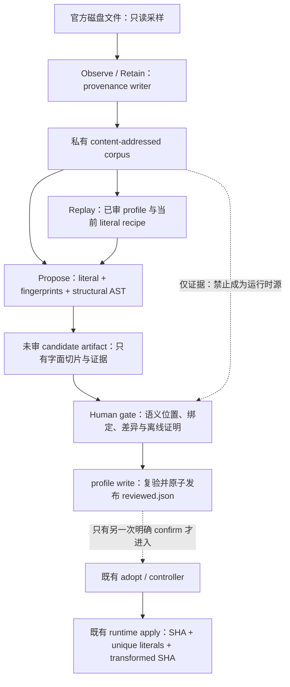

# Host seam 升级识别与运维方案

> Publication note: operational identities below are synthetic examples. Private evidence locations and machine execution records are not distributed; historical observations do not qualify a current deployment.

**状态：前向目标方案，尚非实现或部署完成声明。** 本文是官方 Host 升级后「保留证据、重新识别补丁点、审核并发布 profile」的方案主页；不替代运行时设计、D2 裁决或已有 adopt 授权。后续实现以本文的 HSO-0…HSO-6 交付，历史 T1 的 done 状态不重写。

**固定分工：runtime 只精确应用；ops 负责寻找和证明；Human 决定语义；adopt 另行确认。**

Inputs：
- 本机 survey：`PRIVATE_EVIDENCE`；任务背景：`PRIVATE_EVIDENCE`。仅为调查来源，不是公共 build/test 所需文件。
- [T1 provenance](../tickets/T1-host-provenance.md)、[D2 patch surface](../decisions/2026-09-08-host-seam-normalization-and-roadmap.md#d2--evidence-bounded-host-patch-surface)、[运行时设计](../box-runtime.md)、[实施规格](box-runtime-impl-spec.md)。
- 源码基线：`pre-publication-revision`；[LIVE slices](../../packages/box-runtime/src/internal/host/live-slices.ts)、[profile/apply](../../packages/box-runtime/src/internal/host/profile.ts)、[compile hook](../../packages/box-runtime/src/internal/host/compile-hook.ts)、[profile writer](../../packages/box-runtime/src/internal/process/profile.node.ts)、[provenance IO](../../packages/box-runtime/src/internal/io/provenance.node.ts)、[公开 CLI root](../../packages/cli/src/commands/runtime.ts) 是当前实现事实。

## 1. 问题与边界

官方升级后，最常见的结果应当仍是安全拒绝，而不是勉强注入。要降低的是在大 CJS bundle 中重新找到两个正确位置的人工成本，同时防止**给错误位置制作了一个机械上完全合法的新 profile**。

这两个风险不同：
- **False miss / multi-match**：SHA、anchor 或 find 不匹配，runtime 拒绝；ops 应给出可定位的失败证据。
- **Authoring wrong-site**：新 SHA 上错误字符串也可能唯一，`profileFromSource` 也能算出 transformed SHA。SHA 和唯一性不能替代位置的语义审核。

运行时保持以下不变量，不加入识别策略：
1. `LIVE_SLICE_PATCHES` 保留为现有字面 recipe；`PatchProfile` 仍是两个 `SlicePatch`，id 为 `create-session`、`agent-id`。
2. `applyPatchProfile` 先验证整个 `sourceSha256`，按切片顺序在当前字符串上验证 start/end anchor 全局唯一、find 在 `[start, end)` 内唯一，最后验证 transformed SHA。失败码和拒绝行为不放宽。
3. `_compile` / preload 只消费已审、已固定的 profile，对正确目标文件应用现有精确变换。不得解析 AST、扫描 corpus、排名候选或重写 profile。
4. 不能匹配时不做 grokbox 变换；这不是 managed routing 成功。保留既有原字节路径、拒绝信息和 coverage/窗口语义。

不在本方案内：改 Host Agent loop、TURN/STEP 定义、root/compact、工具、Memory/Transcript、SendToUser、官方 renewal；修改 provider 凭据；从档案恢复或执行 Host；自动修复 circuit/attestation；以 ops 验收代替 live canary。超过两个补丁点或扩大修改语义，必须另走 D2 明确批准及 schema/validator/tests，不能藏进候选生成。

## 2. 分层与能力隔离



| 层 | 唯一职责 / 可用能力 | 明确没有的能力 |
|---|---|---|
| Runtime apply | 目标文件、固定 profile、精确字面应用和 compile receipt | parser、corpus、评分、候选发布 |
| Observe/retain | 只读源文件；写 protected provenance、观测指针、切片证据 | signal/spawn Host、adopt、凭据、attestation/circuit 写入 |
| Replay | 验证档案完整性；运行纯字符串 apply；写派生 replay 报告 | 执行 bundle、发布 reviewed.json |
| Propose engines | 候选枚举、结构/邻域分析、字面切片生成 | 自动选中、自动批准、执行候选 replacement |
| Human gate / publisher | 审核特定 source+pair+digest；调用唯一 profile writer | 将分数或一条成功测试当 live 授权 |
| Adopt | 现有独立确认、身份/源/profile/拓扑等预检及控制程序 | 从识别状态自动获得授权 |

实现落点：CLI 只做参数路由、结构化输出及 lazy loading；新增 ops 编排位于 `packages/box-runtime/src/internal/ops/host-seam/`（目标路径），复用现有纯 profile/hash 规则及 IO adapter。parser 只由 ops worker 加载。重 IO、worker lifetime、锁及取消按 [Effect 标准](../effect-box-runtime.md) 收口；纯 shape/fingerprint/score 使用普通 TS。不得让 `host/` 或 modeld 因此依赖 ops。npm 仍只发布 `grokbox`，`gbox` 仍为同义 alias，不新建可安装产品。

## 3. Observe/retain：先让真实入口产生可重放证据

### 3.1 一个 provenance writer，两个显式入口

建立 `observeHostProvenance` 用例：**采样 → retain → 精确 knife-point observation → 发布观测 receipt**。

- 新 `runtime profile observe --from <abs>` 调用它，适用于离线文件和显式运维采样。
- 既有 `runtime watchdog run` 的真实 composition root 在 reconciliation 前调用同一用例；inhibit/circuit open 不阻止这个无进程动作的 provenance 阶段。receipt 保留原 control outcome，另加 provenance 子结果；capture 失败报告整体 partial/非零退出，但不改写原 control 事实。观察失败不能制造收敛、清 circuit 或授予后续动作。
- `runtime status`、`runtime contracts`、`runtime profile status` 仍为只读：缺树就报告 missing，不偷偷 capture、prune、replay 或 repair。
- 从旧 `internal/process/watchdog.ts:observeAndHeal` 中迁出 **retention/snapshot 能力**，而不是重新接回整个旧函数。旧函数包含 `signalIfMatch` 等动作，不得拿它闭合新的 observe 路径；公开入口必须在不提供这些能力时也能完成 retain。
- 不因 controller 的同 operation receipt 吸收重复请求而漏掉下一次磁盘采样。provenance 采样位于该控制去重之外，但仍在同一命令 Scope 内；它不是第二个 controller。

### 3.2 采样、寻址和写入规则

1. 显式绝对路径、允许的源根、regular file、无路径穿越；不接收代码字符串、stdin bundle 或 URL 下载作为隐式来源。
2. 固定 fd 后读取有界原始 bytes；核对读前/后 fd 身份、长度与版本信息，并复核 pathname 未换代。源变动报 `source_changed`，不把混合字节发布为一代。仅以实际采到的 bytes 计算 SHA；不信任 caller 传入 SHA。
3. UTF-8 必须可无损往返，保留 BOM、hashbang、CRLF 和全部空白。无法往返报 `unsupported_encoding`；不先格式化再取 hash。上述完整性模型针对正常升级/并发故障，不声称防御同 UID 恶意篡改文件、时间信息或审核记录。
4. 用 root-scoped provenance 锁及唯一 staging 写 `0700` 目录 / `0600` 文件，完整读回、hash/sync 后发布 generation，再原子更新 HEAD。已有 SHA 的 source 不可覆盖；已有 bytes 不符即 `corpus_corrupt`。
5. HEAD 只是「最新完整观测」指针，不是当前 live 内存代次。缺 meta/profile 或中断 staging 保留为 partial，status 不修复；下一次显式 observe 可以重建可验证的派生 metadata。
6. 同 SHA 重复 capture 不重复写完整 source；matched profile 的后续证明存为独立内容寻址引用，不靠重写 source 或不可信 `matchedProfileId` 字符串升级支持状态。

私有根布局（逻辑约定，新增子目录由对应 phase 实现）：

```text
<boxRoot>/
  host-bundles/
    HEAD
    generations/<sourceSha>/source
    generations/<sourceSha>/meta.json
    generations/<sourceSha>/diff.json
    profiles/<profileSha>.json       # 已发布 profile 的不可变 replay 副本
    reviews/<reviewDigest>.json      # 人工审核记录；不是执行授权
    replay/<inputDigest>.json        # 派生结果，可失效重算
  contracts/                        # 辅助 contract windows；独立于两个补丁点
  profiles/reviewed.json             # 唯一当前可安装 profile
```

candidate artifact 存到显式指定的受保护私有路径，不自动放入 `profiles/`。整包只属于 `host-bundles/`；profile authoring/launch 不另造完整副本。合同切片保留与完整 provenance 保留是两种政策：不能用「只留切片、临时整包用完丢弃」否定 T1 的正式档案树。

### 3.3 KEEP 与保护

- 沿用 **KEEP=16** 的 active generation 目标；至少保护当前观测的磁盘 SHA、可信记录指向的仍运行 Host 源 SHA、最近一个已审且 replay 匹配的 SHA。
- 同时保护正在 replay/propose/review 的 source、baseline 和其必要 profile 副本。任务获得有界 read lease；人工 pending review 使用显式 pin，不能靠 mtime 猜仍在使用。
- 保护集合优先于数量。受保护代数超过 16、保护事实未知或容量不足时，报告 `retention_pressure` / `cleanup_deferred`，允许暂时超额；不淘汰保护代来伪装 KEEP 成功。
- 按观测顺序与 SHA 稳定排序，只选择未保护旧代。observe 可产生 `retentionPlan`（plan digest、观测版本、保护集合、拟移出 SHA/bytes、原因）；执行必须显式 `profile prune --plan <abs> --confirm`，在同一 provenance 锁内复核计划 digest、当前保护集合与 read leases，变化即 `plan_stale`。
- 遵守执行环境安全删除政策：默认只留计划；只有已授权且已验证的 trash/recycle 路径才能执行移出，不沿用裸 `rm`。trash 失败保留源，不能报告已清理；未知或 protected 目标禁止移出。receipt 记录 active 集合变动，不能把 trash 中字节当可用 corpus。只读命令永不清理。
- archive 的存在不授权恢复、注入或执行其 source。所有 retained source、片段、候选和本机路径均禁止进入 git、npm tarball、公共 CI artifact 或常规日志。

## 4. Replay corpus：两类证据，不混成一个绿灯

### 4.1 修正 observation 与 knife-point 的语义

两个真实补丁点只能由 `SlicePatch` 描述。四个旧 contract names（`create-session`、`session-options`、`agent-id`、`prompt-session`）是另一组观察窗口，不能凭同名对应补丁点。

- `patchImpact` 以 **source SHA × slice-id × recipe/profile digest** 的精确重放结果为准。
- `extractContractSlices` 的 first-`indexOf` 结果不能再产生 `patchImpact=unchanged` 或 `review=none`。保留历史 metadata 时标 `legacy-window`；缺少唯一位置/来源证明的值为 unknown，而不是空数组 `driftedSlices=[]`。
- 辅助 contract window 若继续输出，也须报告全部命中数与各自 selector 版本；多命中/缺失不取第一条。它们以 `contract:<name>` 命名空间显示，不进入两个 slice 的通过率。
- `lineDiffStats` 只作大小/变更量提示；common-prefix/suffix 单 hunk 不是定位器，不生成 patch。

### 4.2 每代必须输出的矩阵

对明确选择的 corpus 范围，完整列出 `create-session`、`agent-id` 两行，不因第一条失败或未知 SHA 隐藏另一条。每行至少有：

`sourceSha, profileSha/recipeDigest, sliceId, evidenceKind, sourceIntegrity, startCount, endCount, findInWindowCount, findGlobalCount, endAfterStart, locationRange, code, runtimeChecked, semanticLabelState`。

计数规则必须对应实际 apply：start/end 是**当前 pass 字符串上的全局计数**，find 只在 `[start, end)` 检查唯一，end 不含在窗口中。当前 LIVE / 新候选标准顺序为 `create-session → agent-id`；历史已审 profile 必须保持其原始 `slices` 顺序，不能重排。第一条 replacement 可能改变第二条的计数和位置。报告分别标注原始 `sourceRange` 与该 pass 的 `passRange`；golden/AST 位置始终对原始源，不能用插入后的 offset 对错坐标。ops 可补充独立诊断扫描，但要注明 `diagnosticOnly`；最终结论必须运行原 `applyPatchProfile`，trace 与其结果不一致时报 `trace_mismatch`，不能建立第二个宽松 apply。

| 证据 | 要求 | 能得出的结论 |
|---|---|---|
| 已审 profile 对自己的 retained SHA | 校验 profile 副本 digest、source bytes、完整 ordered apply 和 transformed SHA；比对独立 golden site labels | `reviewed_match`，仅静态适配，不证明 live |
| 旧 profile 对新 SHA | 原 `applyPatchProfile` 必须返回 `unknown-sha`，即使 anchors 仍唯一 | 不得继承旧批准 |
| 当前 LIVE literal recipe 对未知 SHA | 逐 id 列出精确机械结果；可以在内存算临时 profile 做纯字符串 replay | `unique_unreviewed` 或明确缺失/多匹配；不是 supported |
| candidate pair 对其 target SHA | 校验候选 digest、两个位置、顺序、唯一性和预期 transformed SHA | 机械可用、等待人工语义审核 |
| 缺 profile 副本、档案损坏、范围截断 | 记录 `missing_profile/corpus_corrupt/incomplete` | 不能算完整通过 |

失败至少区分：原有 `unknown-sha`、`anchor-missing`、`anchor-duplicate`、`find-missing`、`find-duplicate`、`slice-not-unique`、`transformed-mismatch`，以及 ops 的 `wrong-site`、`ambiguous-site`、`source_changed`、`corpus_corrupt`、`analysis_incomplete`。不要用一个“drift”吞掉它们。

**Loud fail：**目标 SHA 没有已审且机械/位置重放通过的 profile，support 就是 `unsupported_bundle`。两条 literal 都唯一、候选分数高或生成了新的 transformed SHA，都不能改成 supported。未知值不是 unchanged；空 corpus 是 `corpus_missing`，不是 0/0 通过。

### 4.3 Golden 的独立性

- corpus 保存该 SHA 当时已发布 profile 的精确 bytes/digest，以及独立审核的两个 site labels（原始 byte ranges、角色、审核来源）。profile 名称本身不构成 approval。
- golden site labels 不能由被测 matcher 自动更新。历史匹配 profile 重放失败、matcher 漂到别处、候选错误地穿过负例都使回归失败。
- 新 recipe/engine/parser 版本产生新的 replay key：`sourceSha + profile/candidate digest + tool/engine/parser/recipe revision`。不复用旧版本的绿色 cache。
- 实际私有 corpus 只做静态定位、纯字符串变换及受控语法检查，不运行 bundle。公开 CI 使用独立编写的 synthetic corpus；缺私有档案只降低真实升级覆盖声明，不阻断公共 build。

## 5. Propose engines：互补识别，输出仍是字面字符串

### 5.1 统一候选模型与执行顺序

新 SHA 默认运行 literal、fingerprint 和 structural 三类证据，合并到同一候选表；不是让三套 matcher 分别决定“正确位置”。已审 SHA 的精确 replay 已通过时，无需重复生成新 profile。

1. Literal engine 枚举当前 LIVE / 明确 baseline profile 的全部 anchor/window 命中，不取 first hit。
2. Fingerprint engine 在函数/邻域可能区域内枚举支持信号；无 AST 时只能声明 textual evidence，不能宣称命中可执行方法。
3. Structural engine 在独立 worker 中解析 CJS，给出结构候选和绑定关系，佐证或反驳前两类结果。
4. 按 source byte span + slice-id 聚合证据；仅当 bindings 与字面 patch digest 也相同时才合并候选。相同位置但不同 replacement/绑定的 variants 必须分别保留，不能 first-wins。生成有限的两切片 pair，验证其上下文关联、范围无冲突及完整精确 replay。
5. rank 只改变呈现顺序。没有“最高分自动选中”，也没有分数阈值自动批准。

baseline 是明确的 retained SHA 与其已审 profile；不默默挑一个看起来最近的版本。无 baseline 时标 `baseline:null`，仍可从当前 recipe/结构规则提供人工候选，但不能声称历史连续性。

### 5.2 `create-session` 的结构形状

定位角色是 **inference options 对象上的同步 session factory 方法入口**，不是任意叫 createSession 的函数、调用表达式、字符串或文档片段。

具体规则：
- 枚举对象成员中的方法 / 函数值属性，关注两个参数槽位：request-id callback 与 session options；追踪这两个参数在方法体内如何进入官方 session 构造路径。名称是证据，不是 AST 身份。
- 同一对象的 sibling 方法形状为支持信号：例如单参数的 post-turn labeling 操作。`recordPostTurnLabeling` 的拼写和紧邻关系权重较高，但不是必须的绝对行序；无关 sibling 重排不应丢掉对象归属。
- 官方 model/client/session 初始化路径与返回 session 的结构为角色证据。`createCursorInferencePromptSession` 等名称仅加强证据，不要求整段方法 AST 精确相同。
- 参数名重命名可通过 lexical binding 映射为实际 callback/options 标识符；不能从“某个二参函数”直接推断参数语义。成员名、整个 sibling 家族或调用合同同时改变时，保留候选但要求人工重新证明角色。
- 自动字面 recipe 只覆盖可明确绑定的同步普通参数形状。async/generator、rest/destructuring/default 参数、computed key 或包装层变化可被识别为候选，但不猜如何改签名；标 `unsupported-binding-shape`，交人工处理，必要时走 D2。

插入点必须在该方法的 directive prologue **之后**、第一条官方 provider 初始化语句 **之前**；不能破坏 `"use strict"`，不能再次退到 factory 调用之后。生成时使用当前源码实际参数标识符，并检查插入临时变量的 scope collision。guard 只做既有 route hook 调用，非 `undefined` 返回即接管，`undefined` 继续原官方 body。不得执行官方 factory 才决定是否 managed。

### 5.3 `agent-id` 的结构形状

定位角色是 **普通 main TURN 构造、随后传入上述 session factory 的 options 对象**，不是第一个 `agentId: host.getConversationId()`。

具体规则：
- 找到绑定到局部变量的 `ObjectExpression`；关键 field shape 是模型选择项的值来自同一个 Host 对象的成员（现役例子为 `modelId: host.subagentModelId`）。不要求变量叫 `mainSessionOptions`，也不要求该字段排第一。
- 在同一词法作用域追踪该对象绑定，确认它作为 session factory 的第二实参使用，例如 callback 内 `host.inference.createSession(callback, options)`。允许 callback/局部变量改名；不因距离变远或无关声明重排丢失 def-use 关系。
- main TURN 归属、第一实参 callback 来源、同一 Host receiver，至少由作用域/调用位置和独立邻域证据共同确认。只有同名 getter 或 options 字段不足以排除后台 shell/subagent 路径。
- 要插入的 agent 表达式来自这个 Host 的已知 Agent 身份能力；TURN 表达式来自 **已有 TURN binding**。确认初始化在对象求值前、作用域一致、非 STEP callback id，不能把任意 UUID 变量当 TURN，更不能生成新 UUID。
- 对发生遮蔽、复杂控制流、getter/computed property、重复 identity 字段或可覆盖字段的 spread，报告绑定/覆盖顺序风险；不通过简单“名字相似”把它消掉。不能证明的 pair 不得发布。

字面 replacement 只插入 `agentId` 和 `invocationId`，保留原模型字段及其他 options 字节与求值顺序。已经包含注入字段/route guard 的源码不能再自动插一次：标 `already-patched-or-contract-changed`，重新审核其合同。

### 5.4 韧性与 parser 失败

| 变化 | 可保留的证据 | 必须降低的声明 |
|---|---|---|
| 空白、换行、注释、minify | AST 结构、作用域、参数槽位、对象字段/调用关系 | 旧 literal 往往失效；重新切取原字节 |
| 局部变量/参数改名 | lexical binding 及其 def-use | 名字指纹失效，不能借旧名字生成 replacement |
| 无关方法/字段重排 | 同一对象成员集合、options 到调用的关联 | “紧邻/第一字段”加分消失 |
| 公共成员/字段改名、签名或控制流变化 | 部分 shape、位置候选 | 不保证语义存续；manual review / D2，而非自动兼容 |
| 多个同构方法/对象 | 全部候选与各自调用邻域 | 不可把 best-of-N 改叫 unique |
| parse error / timeout / OOM | literal 与已标注为 textual 的 fingerprints | `structural: unavailable`，不是无候选或已证明正确 |

选用一个锁定版本的严格 CJS parser（实施默认 Acorn），在 ops worker 中运行；grammar/options 与 parser 版本进 receipt。不得使用宽松 error-recovery AST 当证明。可支持 CJS hashbang/顶层 return 等明确语法，不能执行 module 来“帮助解析”。

parser 失败时保留 literal/fingerprint 候选、失败位置类别与 `syntaxUnverified`；不得静默轮换 parser 直到某个结果好看。人工仍可在明确 limitations 下审阅 literal 候选，结合目标 Node 的 **syntax-only** 检查及 synthetic replay；无法证明语法/位置就保持 blocked。`node --check` 仅可在有界 owned worker 内使用，不能替换为 require/import/vm/`_compile` 执行真实 source。

AST offset 通常是 UTF-16 code unit；候选 artifact 统一使用 **原 UTF-8 byte range、end-exclusive**。必须验证双向映射和 substring hash，不能把 AST offset 直接作为 byte offset。最终字符串始终切自原 bytes，不用 pretty-printer 重印 Host。

### 5.5 多信号 fingerprint 与评分

使用版本化、可解释的四组信号；同源信号在组内封顶，避免把同一个名称的 regex、token 和 AST 三次计票。

| 信号组 | 满分 | 例子 |
|---|---:|---|
| 局部调用/绑定关系 | 35 | options 流向目标 session 的第二实参、callback/Host/TURN 同作用域 |
| 方法/对象 shape | 25 | 二参同步成员、参数用途、模型字段与成员访问结构 |
| 邻域角色 | 20 | 同对象 labeling sibling、main TURN 周边调用族；紧邻只是增强项 |
| 字面/归一化 token 指纹 | 20 | 稳定属性/短字符串、去空白 token n-grams、标识符角色归一化后的局部摘要 |

每项输出 `signalId, group, matched|missing|contradiction, contribution, evidenceRange`。短字符串不是唯一方法；AST 也不是独占识别器。硬矛盾（后台路径、错误 options 绑定、TURN 未初始化、重叠修改、语义无法保持等）不能靠分数补偿。

排序为 score 降序，再按 byte range / candidate digest 稳定排序；tie-break 只保证可重复输出。必须同时显示：结构候选总数、保留/截断数、每组证据、精确 anchor/find counts，以及 pair 的完整 replay 结果。一个候选的 anchors 唯一，不等于语义候选只有一个。多角色候选的消歧须有人工证据；若实际上需要多处 factory 都打补丁，则现有两切片合同不够，不能偷偷只选一处。

### 5.6 预算

初始 ops envelope：source ≤64 MiB；单次 parser worker 45s、heap ≤1536 MiB，平台可用时另限 RSS 2 GiB；同时最多一个 parse worker。超限明确失败，不拆片伪造完整 AST。

候选最多每 slice 16 个、pair 16 个；单个 anchor/find/replacement 各 ≤8 KiB；每个 review context 前后各 ≤512 UTF-8 bytes；candidate artifact ≤1 MiB。minified 单行不突破 byte 窗口。超出任一限制设 `truncated/analysis_incomplete`，展示结果也不能成为发布依据。要扩大限制，须重新跑预算 fixture 并记录新策略版本，而不是静默截断。

worker 使用显式、最小环境及 private cwd；清除 `NODE_OPTIONS`、额外 loader/preload 注入和 `GROKBOX_ALLOW_LIVE_HOST` 等 live 开关，不继承 provider/Gateway/daemon 凭据。语法检查不能因继承 require hook 而执行别的代码。worker 只读固定输入、写私有派生文件，无网络与 Host mutation capability。

超时必须终止并回收 **owned parser/check worker**，不是对现役 Host 发信号；报告 worker exit/signal、峰值内存与耗时。Promise.race 不代表同步 parse 已停止。缓存只在完整输入 digest 相同时有效。

## 6. Candidate、人工 gate 与 profile write

### 6.1 Candidate 不是 PatchProfile

候选文件使用独立 discriminator，根结构不提供可被旧 loader 误认的完整 PatchProfile。最低 schema：

```text
kind: "host-seam-candidates", schemaVersion: 1
source: { sourceSha256, bytes, encoding: "utf8" }
baseline: null | { sourceSha256, reviewedProfileSha256 }
analysis: { toolRevision, recipeRevision,
            engines: [{ id, version, status, failureCode? }], complete, truncated }
candidates: [{ candidateId,
  patch: { id, startAnchor, endAnchor, find, replacement },
  sourceRange: { startByte, endByte, windowSha256 },
  passRange: { pass, startByte, endByte },
  counts: { pass, startGlobal, endGlobal, findInWindow, findGlobal, endAfterStart },
  bindings: { callback?, options?, host?, turn? },
  rank: { score, signals, semanticCandidateCount }, limitations }]
pairs: [{ pairId, orderedCandidateIds: [createSessionId, agentIdId],
          reviewDigest, mechanicalReplay, transformedSourceSha256?,
          semanticChecks, blockers }]
```

`sourceSha` 是原 bundle bytes 的 SHA256；`profileSha` / `--expected-reviewed-sha` 是精确 profile JSON bytes（含发布换行）的 SHA256，不是 source SHA。派生 artifact/review 使用版本化规范序列化摘要；`reviewDigest` 绑定 source、baseline、所选 pair 的全部字面切片、bindings、规则版本和 replay/semantic evidence。writer **重新计算**，不信任 artifact 自报 digest/count/score。任何人工修改、pair 切换或规则升级都需要新 digest 和重新审核。candidate 内只允许这两个 slice ids；不能夹带任意 CLI、eval 程序、第三片或 output path 指令。

引擎可以生成 patch 数据，但不能执行 replacement。字面 start/end anchors 从目标邻域选取并按现有 apply 验证；不能把任意唯一的大窗口当正确位置的证明。总 modified spans 只能是两个已审核的小接缝；超过预算或涉及业务体重写转 D2，不扩大字符串来规避审查。

### 6.2 Human gate

Human 审阅受保护 artifact 和有界上下文，明确选择 pair，并记录该 digest：
- 两个位置是否属于同一普通 main inference 链，而不是名称相同的副本；多匹配如何排除其他候选。
- guard 是否早于官方 provider 初始化、晚于 directive prologue，未分配 Bot 是否仍由原 body 构造官方 session。
- options 是否传给目标 factory；Agent/TURN 来源、初始化/遮蔽/覆盖顺序是否正确；没有把 STEP 当 TURN。
- diff 是否只实现既有两个切片的语义；root、工具、store/Memory、renewal 未被重写。
- 同 source 的字面 replay、语法检查、对应 synthetic 行为正/负例是否完整；parse/语义未知项不能当成功。

review 记录包含 selected pair/digest、reviewer、时间和结论/消歧依据。CLI 中的 digest 确认是对操作意图的绑定，**不是密码学上的 Human 身份证明**；propose/replay 自动化不得自填批准。调度/权限层只在 owner 明确批准该 digest 后开放 publisher，不能仅因“生成成功”授予写权限。

### 6.3 唯一 publisher

扩展现有 `runtime profile write`，不另建安装器：

```bash
grokbox runtime profile write --from /absolute/host-main.cjs \
  --candidate /private/review/candidates.json --select pair-1 \
  --reviewed-digest <digest> --expected-reviewed-sha <sha-or-none> --json
```

- `--candidate` 是唯一新增的公开自定义切片输入；不另开无审核的 `--slices` 数组捷径。手工作者也生成同一种 candidate artifact，不再维护 LIVE/SYNTHETIC/手工三种公开 authoring dialect。
- 对新 source SHA，Phase 5 后必须经过 candidate+review digest。裸 `--from` 只允许当前已审 profile 同 source、同内容的幂等重验，不作为未审发布 fallback；无审核新 SHA 报 `review_required`。这是 ops gate 的明确收紧，不改 runtime apply。
- 在同一 publication lock 下，重读并比较 `--expected-reviewed-sha`（`none` 只允许目标不存在）；source/profile/candidate 改变或并发赢家已发布时拒绝，不默默最后写入覆盖。需要两把锁时固定 `publication → provenance` 顺序；observe/prune 不反向获取 publication 锁。发布期间 pin source/baseline/profile 引用，避免 retention 抢先移出；这些锁均不参与 live controller 锁域。
- 重新冻结 slices，校验 source fd/bytes/SHA、预算、两 id、ordered uniqueness、无冲突修改、review digest、完整 `profileFromSource → applyPatchProfile` 及 transformed SHA。
- 唯一 staging、protected mode、读回/sync、发布前源身份复验和原子 rename 继续由现有 writer 负责。先准备不可变 replay profile/review 副本，再发布 `reviewed.json`；派生索引可随后补齐。不得宣称跨多文件原子事务，缺 receipt/index 报 gap，不伪造提交结果。
- publisher 只写 profile/审核证据，不改 `LIVE_SLICE_PATCHES` 源码、不重建 preload、不写 Host/attestation/desired、不启动 adopt。采用该 profile 仍须现有独立 `runtime re-adopt --confirm` 与完整实时预检；本方案不发出这个授权。

## 7. CLI 合同与运维路径

以下是目标命令，不表示当前已经提供。所有命令 local-only；`--from` 只读源文件，所有输出路径须显式受保护并拒绝 symlink/遍历/与输入同文件。

| 命令 | 输入 / 产物 | JSON 必备结果 |
|---|---|---|
| `runtime profile observe --from <abs>` | retain + 精确 observation；写 provenance，不做进程 mutation | observedSha、bytes、retained new/existing、完整性、knifePoints 两行、protection/retention、gaps |
| `runtime profile replay --sha <sha>` 或 `--all` | 只用 active retained source/profile，完整矩阵；两选择互斥；可显式 `--out` 留报告 | rows、requested/completed、truncated、regressionPassed、supportGatePassed、失败码、输入/tool digests |
| `runtime profile prune --plan <abs> --confirm` | 复核 observe 生成的计划，只经授权 trash adapter 移出未保护代 | plan digest、protected/rechecked、moved/retained/failed、retentionPressure；无永久删除或进程动作 |
| `runtime profile replay --sha <sha> --candidate <abs> --select <pair>` | 机械验证未审 pair，只允许 target SHA 一致 | mechanicalPass、reviewDigest、support=`unreviewed`、语义 limitations；不写 reviewed |
| `runtime profile propose --from <abs> [--against <sha>] --out <abs>` | 枚举/排序并写未审 artifact；out 必填，不覆盖已有文件 | source/baseline SHA、engine status、candidate/pair ids、分数/counts、limitations、artifact path/digest、`published:false` |
| `runtime profile status [--sha <sha>]` | 只读元数据/完整性状态，不重跑识别 | latestObservation、lastReviewedMatch、corpus state、两 slice 的 replay 状态/版本/时间、pending candidates、protectedShas、retentionPressure、stale/truncated/gaps |
| `runtime profile write …` | §6 唯一 publisher | published profile/source/transformed SHA、review digest、前置版本、publication receipt；`adopted:false` |

默认 stdout/JSON 只给元数据，不含 bundle、replacement、上下文正文或任意 parser stderr。人工在私有 artifact 中看有界片段；`status` 不能因输出省略而把 `truncated` 隐藏。源路径仅作本地定位提示，不是跨机器身份。

退出约定：参数错误 exit 2；执行/IO/预算失败 exit 1；`replay` 的请求范围有未支持/缺失/损坏项时 exit 1。完整的 propose/status 查询可以 exit 0 且结果仍为 ambiguous/unsupported/needs-review，必须显式输出这些状态，不能用通用 `ok` 表示已批准。`write` exit 0 只代表发布，不代表 adopt。

Golden 回归可以正确断言一次 `unknown-sha` 拒绝，即 `regressionPassed=true`；它不能因此把该新 SHA 的 `supportGatePassed` 改成 true。未审 candidate 即便 `mechanicalPass=true`，support 仍 unreviewed；Human gate 使用机械与语义证据，不要求循环地“先已发布才允许审核”。

官方升级后的操作顺序只有一条：
1. 正常 observe/watchdog 采样新 SHA；unsupported/gap 显示出来，不猜补丁。
2. Operator 看 profile status，补 retain 缺口，运行该 SHA 的 replay。
3. 运行 propose；明确 baseline，或接受无 baseline 的较弱证据；完成候选消歧。
4. Human 审查并批准具体 pair digest。
5. profile write 重新验证并发布。若源再次升级，旧批准失效，回到该新 SHA 的识别；不把旧切片自动平移。
6. **只有另获授权**才进入已有 adopt；ops phases 的完成既不需要也不触发 live canary。adopt 失败按原控制合同处理，不回头自动降级、清 circuit 或换候选。

## 8. 分阶段交付票据

这些票据嵌入本文，作为一个前向链执行，不新开竞争方案文档。测试文件和 verifier 命令均为实施目标；只使用 Bun。每片提供实际 pass/assertion counts、命令退出状态和坏变体反例，不接受零测试或全部 skip 的绿色。

### Phase 0 / HSO-0 — 精确补丁点 observation 合同

- **Goal**：建立两 knife-points 的 ops trace/结果 schema；将四类旧 contract windows 降为独立辅助证据；统一文档中的 slice KEEP=5 与 bundle KEEP=16 分工。
- **Forbidden**：改 `_compile`/runtime apply 行为、用 first hit 代替计数、从 legacy window 宣称 patchImpact unchanged、修改历史 T1 done 或重写 Host。
- **Depends-on**：本文固定边界与 D2。
- **Executable Acceptance**：`bun test packages/box-runtime/test/host-seam-contract.test.ts`。
  1. 背景 handler 提前包含相同 agentId getter、labeling 名称出现多处时，不能选 first hit；缺失/多匹配必须在两 slice 行中明确出现。
  2. 同源、SHA 漂移、start/end 反序、重复 anchors/find、第一切片影响第二切片、错误 transformed SHA，trace 与实际 `applyPatchProfile` 一致；不一致非零失败。
  3. 故意把 trace 改回 `indexOf` 首条/旧 window hash，负例失败；缺数据不输出 unchanged 或空 drift 成功。

### Phase 1 / HSO-1 — 接通真实 observe 与安全 retain

- **Goal**：唯一 provenance writer 进入 `profile observe` 和公开 watchdog 的 composition root；可在没有 process-mutation/provider capabilities 时保留证据。
- **Forbidden**：接回完整 `observeAndHeal`、令 status/contracts 写入、同步抓取 Gateway credentials、auto-adopt、裸永久 prune。
- **Depends-on**：HSO-0。
- **Executable Acceptance**：`bun test packages/box-runtime/test/host-seam-observe.test.ts test/host-seam-observe-cli.test.ts`。
  1. 从真实 CLI root + 注入本地 synthetic Host 文件观察 A→B，两代 source/meta/HEAD 都存在且 bytes/SHA 正确；不是仅直接调用 retainer 的测试。
  2. circuit open、missing desired、控制 operation 已完成等场景仍能独立采样/记录 provenance，控制状态不因此被修复。
  3. 文件换代、并发相同/不同 SHA、磁盘失败、半成品、源/目标 symlink或hardlink 别名均明确拒绝/partial，原始 bytes 不损坏。
  4. 超过 16 代时保护 live/last-matched/in-use；全部受保护则报 pressure。prune 缺 confirm、计划陈旧或新 lease 出现则拒绝；trash 不可用不删除；status 前后文件树不变。
  5. primitive-boundary 探针证明 Host writes/signals、adopt、credential/network effects 全为零；把旧 heal 接回的 mutant 必须失败。

### Phase 2 / HSO-2 — Corpus、golden replay 与状态面

- **Goal**：每 SHA × 两 id 的 loud replay，已发布 profile 的内容寻址副本及独立 site labels，profile status 展示证据完整性。
- **Forbidden**：把临时 profile 算出的 SHA 当批准；只测 latest SHA；从 matcher 自动生成 golden labels；执行 retained Host。
- **Depends-on**：HSO-0、HSO-1。
- **Executable Acceptance**：`bun test packages/box-runtime/test/host-seam-replay.test.ts test/host-seam-replay-cli.test.ts`。
  1. 已审 A+profile 精确通过；B+旧 profile 返回 unknown-sha；B+仍唯一的 LIVE recipe 也保持 unreviewed/unsupported，CLI support gate 非零。
  2. 全矩阵不吞第二条失败；corrupt source/profile、missing tree、副本缺失、截断、陈旧 cache 都非绿。
  3. 一个唯一但错误的 site 与独立 golden range 不一致时 loud fail；更新 matcher 不更新 expected labels。
  4. 故意跳过某 SHA 或用“0/0 pass”替代缺 corpus 的 mutant 被 verifier 拒绝；公共测试不依赖机器私有 corpus。

### Phase 3 / HSO-3 — Literal/fingerprint propose 与候选 artifact

- **Goal**：实现候选统一 schema、互补信号、可解释排序、字面 pair 生成和受保护输出；先交付可人工使用的无 AST 基线。
- **Forbidden**：top-1 自动选择、first-match-wins、自动 profile write、把 textual 命中称为 executable method、改变 LIVE 源码才能支持新 SHA。
- **Depends-on**：HSO-2。
- **Executable Acceptance**：`bun test packages/box-runtime/test/host-seam-propose.test.ts test/host-seam-propose-cli.test.ts`。
  1. 多候选、tie、相关信号重复、错误但稀有名称、字符串中的假 anchors，输出完整 counts/limitations，排名稳定且不提升 approval。
  2. candidate 不能由 PatchProfile loader 或 publisher 当 reviewed 直接消费；out 路径冲突/泄漏风险拒绝，默认 stdout 无源码片段。
  3. 拒绝超预算/截断 pair；原 reviewed.json、Host、模型配置、attestation 和 circuit 前后不变。
  4. 自动取最高分并发布的 mutant 必须在 zero-publication oracle 下失败。

### Phase 4 / HSO-4 — Structural shape worker 与 literal materialization

- **Goal**：按 §5 两种角色规则补充 AST 证据，处理格式/局部改名/无关重排，保留确定的 scope/binding；只生成现有字面 SlicePatch。
- **Forbidden**：AST 独占裁决、全方法深层 AST 等值、松散 parser 恢复树当证明、preload 引入 parser、自动重写业务体。
- **Depends-on**：HSO-3。
- **Executable Acceptance**：`bun test packages/box-runtime/test/host-seam-shape.test.ts`。
  1. 自写 fixture 的 minify、CRLF、Unicode、注释、参数/局部变量改名、sibling/字段重排仍定位正确；输出 substring/range/hash 无 UTF-16/UTF-8 偏移错误。
  2. 二参背景方法、同构副本、shadowed Host、options 传错参数、TURN TDZ、spread 覆盖、模板/正则内伪代码均拒绝或保持需消歧，不扩大编辑范围。
  3. 两 slice 变换后的 synthetic Host 证明：官方 factory 故意抛错不阻塞 managed entry；decline 保持官方对象；正确 Agent/TURN 被传入；没有新增工具/Agent loop。
  4. parser grammar error、45s 超时、OOM、候选爆炸都有结构化失败和 owned worker 回收证明，literal fallback 标明不确定性；现役 Host signal count=0。
  5. preload bundle contribution/import boundary 证明无 parser/ops 新依赖；把 worker/parser 导入 `_compile` 的 mutant 非零失败。

### Phase 5 / HSO-5 — 人工审核到唯一 profile writer

- **Goal**：接通 §6 的 candidate/select/review digest/version 输入；一次发布与 exact replay、review evidence、provenance 副本绑定。
- **Forbidden**：裸 slices / 裸 --from 新 SHA 绕 review、`--force` 绕唯一性、自动批准、写完整 Host 副本到 profiles、发布后自动 adopt。
- **Depends-on**：HSO-2、HSO-3、HSO-4。
- **Executable Acceptance**：`bun test packages/box-runtime/test/host-seam-publish.test.ts test/host-seam-publish-cli.test.ts packages/box-runtime/test/reviewed-profile-write.test.ts`。
  1. 明确人工批准的 synthetic pair 生成普通两切片 PatchProfile；原 `applyPatchProfile` 对相同 SHA 成功，对另一 SHA 仍 unknown-sha。
  2. 审后改 source/candidate/replacement/pair/digest、缺批准、未解决语义 blocker、第三 slice、超限和重叠编辑都零发布；原 reviewed 保持。
  3. 两个相同 expected-reviewed-sha 的并发 publisher 至多一个成功；崩溃/失败 staging、源文件交换、partial 副本不成为已发布证据。
  4. writer receipt 明确 `adopted:false`；所有 signal/spawn Host/adopt attempts=0。假自动确认或默认 --from fallback 的 mutant 被拒绝。

### Phase 6 / HSO-6 — 完整离线闭环与升级门禁

- **Goal**：固定一个跨真实 CLI roots 的可执行交付门：observe → replay loud fail → propose → 外部人工批准 fixture → profile write → replay；证明 runtime 与权限边界没有变。
- **Forbidden**：以 live canary 作为 ops 完成前提、执行私有 corpus、用 mock 重写业务程序、删负例/忽略退出码求绿。
- **Depends-on**：HSO-0…HSO-5。
- **Executable Acceptance**：新增 `bun run verify:host-seam-ops` 汇总前述套件，并运行项目 typecheck、build、runtime layout/import 与原 profile/compile-hook gates。
  1. 两个公开自写 generation 的完整 CLI 流程有非零断言；未审 B 的 replay 正确失败，审核发布后静态支持才改变，进程动作始终为零。
  2. writer 旁路、first-hit、drop-SHA、score-auto-select、全 skip、丢矩阵行、raw dump、自动 adopt 八类坏变体均使 gate 非零。
  3. 在受支持 Node 与固定 Bun 工具链记录大型 synthetic CJS 的 wall time/RSS/退出状态；超限 fixture 失败但 owned worker 无遗留。私有 corpus 可显式运行同一 replay，不是公共依赖。
  4. 最终 evidence packet 含版本、范围、矩阵、各 gate、禁止副作用 attempts/实际 effects、残余 limitations；offline-complete 不自动标 live-qualified。

## 9. 风险与测试矩阵

| 风险 | 防线 / 必须保留的反例 |
|---|---|
| False miss 导致人工仍需搜索 | 多引擎互补、明确 parser 缺席、baseline 指纹与有界上下文；不靠放宽 runtime 换命中率 |
| 多命中被排名隐藏 | semantic candidate count 与 literal counts 分开；列出 ambiguity；tie/第二副本/候选截断测试 |
| 唯一但错误的 authoring site | 调用/绑定形状、独立 golden labels、Human语义 gate、官方 factory 失败/官方 passthrough synthetic 行为测试 |
| 切片插入破坏 strict/作用域/字段覆盖 | directive、标识符 collision、TDZ、同名遮蔽、getter/spread、already-patched 负例 |
| 正则/模板/字符串混淆代码与文本 | parser 完整语法树；无 AST 则显式 textual-only，不用裸 scanner 的 token 名当解析证明 |
| Source churn / 审批 TOCTOU | fd/路径复验、原字节 SHA、candidate/review digest、publication CAS；新 SHA 重新审核 |
| Corpus 污染 / 自证循环 | immutable source/profile digest、独立 labels、corrupt/missing loud fail，不从 matcher 刷新 expected |
| Parser 依赖膨胀或资源失控 | ops lazy worker、版本锁、预算与回收测试、preload contribution gate |
| 隐式 repair / 自动 adopt | capability 隔离 + primitive-boundary 负例，不只 mock 顶层方法或查最终文件树 |
| 整包/片段/错误日志泄漏 | 私有 0700/0600 artifact、字节预算、metadata-only stdout、无 raw parser stderr；git/npm/公共 CI 扫描 |
| Human 批准错误 | 不承诺自动语义正确；展示反证和变换 diff、绑定 digest、保留证据。无法解释为何是 main seam 就不发布 |

## 10. 明确禁止

- 在 `_compile`、preload、session hook 或 modeld hot path 引入 Acorn/Meriyah/TypeScript parser、ast-grep、fuzzy search、fingerprint ranking、LLM 或 best-of-N。
- 放宽 source/transformed SHA、全局 anchor 唯一性、window 内 find 唯一性；把第一次/最高分命中当应用位置。
- 用 `extractContractSlices` 的 first-hit、四个旧 window hash、行 diff 或 `driftedSlices=[]` 证明两个 LIVE knife-points 未变。
- drift 触发 auto re-author、auto `profile write`、auto `--confirm`、auto adopt、Host TERM、清 circuit 或伪造 attestation。
- 让 candidate JSON、corpus HEAD、matchedProfileId、评分或 golden 测试自行升级为授权。
- 对真实/retained Host 使用 require/import/eval/vm/`Module._compile`；把档案当还原盘、运行时 source 或公共 fixture。bundle/候选内的注释、字符串和指令一律是待分析数据，不能扩大操作权限。
- 把 source、完整 AST、无界行、provider/Host payload、credential、raw parser/SDK error body 放进 git、npm、公共 artifact 或普通日志。
- 因未知、parse 失败、性能超限或人工未批准而静默退到更宽松的匹配/执行路径。

**完成标准：**官方新 SHA 有完整 provenance；每个补丁点有明确匹配/拒绝/未知；候选可被人审阅并精确重放；只有绑定过审核的字面 profile 能发布。整个 ops 链离线可验，runtime 仍只做原来的 fail-closed apply，live adoption 始终是另一次授权。
